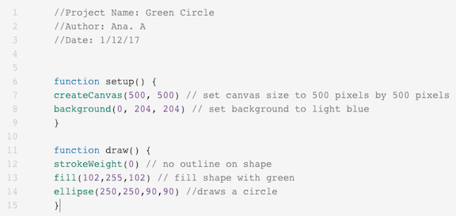

<header title='Introducing P5.js & Mouse Input' subtitle='Lesson 1'/>

<notable>

<iconp src='/icons/activity.png'>### Overview</iconp>
Students discover how code is used to create art. Students learn the basics of P5.js and code their first shapes. At the end of the session, students learn how to make their sketch interactive with the mouse input variable.

<iconp src='/icons/objectives.png'>### Objectives</iconp>
- Students will be able to create shapes of different colors and sizes in P5.js.
- Students will be able to use mouseX and mouseY as arguments to make code interactive in P5.js.

<iconp src='/icons/agenda.png'>### Agenda</iconp>
###### Length: 60 minutes
1. Explore: You can code art! (5 mins)
2. Explain: Open Processing (20 mins)
3. Engage: P5.js shapes and colors (30 mins)
4. Elaborate: Mouse input (5 mins)
5. Evaluate: Share project (5 mins)

<note>

<iconp src='/icons/materials.png'>### Materials</iconp>

###### Teacher materials
- [ ] Projector
- [ ] Computer
- [ ] [Example Code][examplecode]

###### Student materials
- [ ] Computer
- [ ] P5.js zine
- [ ] [Grid Paper][gridpaper]
- [ ] pencil
- [ ] coding journal

<iconp src='/icons/vocab.png'>### Vocabulary</iconp>

- see p5.js zine

</note>
<pagebreak/>

#### Explore: You can code art! (5 minutes)
- [ ] Lead a discussion about art.
  <iconp type='question'> What mediums do you like to use when creating art?</iconp>
  <iconp type='answer'> Colored pencils, paint, clay, etc. </iconp>
  <iconp type='question'> What is interactive art? Has anyone experienced interactive art?</iconp>
  <iconp type='answer'> Rain room, infinity mirror room, etc. </iconp>

  >> “In this class we are going to learn to create art with code!”

<note>
Examples of interactive art rooms
- [Yayoi Kusama's Infinity Mirrored Room][infinity] at The Broad
- [Random International’s Rain Room][rain] at LACMA
</note>

- [ ] Before we start coding, let’s look at what’s possible:
  - [Processing Connexions][example]
  - [Patatap.com][example2]

- [ ] Introduce Processing, a language to code for the visual arts.

  >>“The coding language we will use is called p5.js. It’s a JavaScript library that starts with the original goal of Processing, to make coding accessible for artists and designers!”

- [ ] Show visual beat machine project
- [ ] Ask for student observations.
  <iconp type='question'> What is happening? </iconp>
  <iconp type='question'> What do you hear and see? </iconp>

<pagebreak/>
#### Explain: Open Processing (20 minutes)

- [ ] Distribute Processing zine
  - This booklet will provide students with the code and concepts needed throughout the program.

- [ ] **Explain** the Open Processing interface:
  - Play/Replay: Plays your sketch
  - function setup () { } : Sets up your canvas. Runs only once.  
  - function draw () { } : Animates and draws things onto your canvas. Runs in a loop.  
  - // : A comment is a line that gets ignored when the code is run. This is useful for adding notes.
  - **Demonstrate** a bug/syntax error in your program by deleting a curly brace in one of the functions and pressing play.

<note type="tip" title="Tip">
- Log into your account before students log onto their Open Processing accounts.
- Since this is the browser version of P5.js, errors (if any) will not show in the console, instead the play screen will turn gray.
</note>

- [ ] Direct students to log onto their open processing accounts.

- [ ] **Model** starting first sketch on open processing.
  - Delete all code except "function setup () { }" and "function draw () { }"
  - Add comments for titling project outlined in p5.js zine.

- [ ] **Explain** canvas, coordinate system, and pixels
  - Canvas: Think of the canvas just like an art canvas and your code is your paint. What is the keyboard? (paintbrush)
  - Coordinate system: Unlike the Cartesian coordinate system, here (0,0) starts at the top left corner.
  - Pixels: Unit of measurement on a computer screen (tiny dots of RGB that make up your screen).

<pagebreak/>
- [ ] **Model** drawing ellipse with no outline and filled with color.
<note type="reminder" title="Reminder">
// Comment lines of code.
</note>

#### Engage: P5.js shapes and colors (30 minutes)

- [ ] Students do mini challenge from zine.
 - Draw shapes in various sizes and colors.
 - Integer argument values determine color and shape size.
 - Example sketch of [9 Dots logo][logo]  

#### Elaborate: Mouse Input (5 minutes)
- [ ] Replace integer arguments with mouseX and mouseY to make your artwork animated and interactive.

#### Evaluate (5 minutes)
- [ ] **Reflect:** Students respond to the following questions in coding journal.
  - What did you learn? Greatest challenges? Successes?

- [ ] **Share Out:**  3-4 students volunteer to share their project with the class if time allows.

</notable>
[infinity]: http://www.thebroad.org/art/exhibitions/yayoi-kusama-infinity-mirrored-room
[rain]: http://www.lacma.org/rainroom#about
[gridpaper]: ../../worksheets/gridpaper.pdf
[example]: https://vimeo.com/24930344
[example2]: http://patatap.com/
[logo]: https://www.openprocessing.org/sketch/398615
[examplecode]: https://docs.google.com/document/d/15q7Fc4VpcTd--i7clFKvmVy3GBWp6B8cfGgEZm1w-2w/edit
