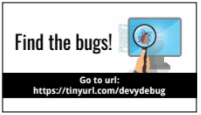
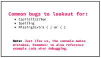
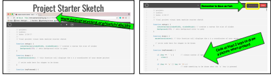
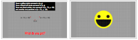

<header title='Visual Beat Machine Project' subtitle='Lesson 5'/>

<notable>

<iconp src='/icons/activity.png'>### Overview</iconp>
In the next few lessons, students will design and create a Visual Beat Machine in P5.js on openprocessing.org. In today’s lesson, students will begin their sketch and program at least two keys to draw a picture when each key is pressed.

<iconp src='/icons/objectives.png'>### Objectives</iconp>
- Students will be able to use the console on openprocessing.org to locate bugs in their p5.js sketch.
- Students will code an if-then conditional to trigger a picture to be drawn when a key is pressed using the Project Starter Sketch.

<iconp src='/icons/agenda.png'>### Agenda</iconp>
###### Total Length: 60 minutes
Participation: Whole Class
1. **Engage/Explore:** Find the bugs! (10 minutes)
1. **Explain:** Console (5 minutes)
1. **Elaborate:** Start Project (45 minutes)

<note>

<iconp src='/icons/materials.png'>### Materials</iconp>

###### Teacher Materials
- [ ] Projector
- [ ] Computer
- [ ] [Lesson 5 slideshow][slides]

###### Student Materials
- [ ] Computer
- [ ] pencils
- [ ] P5.js zine
- [ ] [p5.js Debugging Challenges][debug]
- [ ] [Final Project Starter Sketch][starter]

<iconp src='/icons/vocab.png'>### Vocabulary</iconp>
- Variables: named storage for data
- Functions: a reusable chunk of code that performs a task

</note>
<pagebreak/>
#### 1. Engage/Explore: Find the bugs! (10 minutes)
>> “Today we’ll take a look at common bugs found in our P5.js sketches.”

- [ ] **Independent Exploration:** students go to https://tinyurl.com/devydebug and find the bugs in each challenge.
  - Students write observations and what bugs they found: line number and what they fixed.
  - Remind students to press the programmed keys to have the console check the code within the if-then conditionals.

<note type="tip" title="Tip">
After pressing play, students need to click on canvas for function keyPressed() to work.

**Slides:**
</note>

#### 2. Explain: Console (5 minutes)
- [ ] **Discuss** student observations from debugging challenge.
  <iconp type='question'>What did you use to help find the bugs in the code?</iconp>
  <iconp type='answer'>The console.</iconp>
  <iconp type='question'>What information does the console give you?</iconp>
  <iconp type='answer'>The line number of the possible bug.</iconp>
  <iconp type='answer'>The type of error or a possible solution, ex: missing ) after  argument list.</iconp>
 

- [ ] **Review** the solutions of debugging challenges 1-3 on openprocessing.org over the projector. https://tinyurl.com/devydebug
  - **Challenge 1**
    1. Line 10 - ‘w’ in windowwidth needs to be capitalized, correction: windowWidth
    1. Line 11 - backgrund is spelled incorrectly, correction: background
    1. Line 90 - elipse is spelled incorrectly, correction: ellipse
  - **Challenge 2**
    1. Line 35 - missing {'{'} after the if-then conditional
    1. Line 57 - missing {'}'} at end of function call  backgroundCircles()
  - **Challenge 3**
    1. Line 55 - missing ) at the end of the line
    1. Line 56 - remove extra (  before random
    1. Line 111 -  missing ) at the end of the line
  - **Extension: Challenge 4**
    1. Line 9
    1. Line 22
    1. Line 31
    1. Line 55
    1. Line 62
    1. Line 80

<note type="tip" title="Tip">
- Note: An error in conditionals will not show up immediately, for challenge 1 line 90,  the ‘a’ key needs to be pressed since the error in the code is in the function call randomPokeball.
- Challenge 4 is for meant to be challenging, this is for students who quickly get through challenges 1-3.

**Slides:**
 </note>

- [ ] **Review** the common mistakes made in sketches: spelling, capitalization, missing/extra parentheses or curly braces.
  >>"The console isn’t perfect in finding bugs. Remember to also reference other working code when debugging."

#### 3. Elaborate: Start Project (45 minutes)

- [ ] **Project:** Students begin their final project sketch. Students should have at least 2 keys programmed to draw when pressed.
  >>"You have all been working hard these past 4 weeks learning p5.js. Today we start our final project! Create something you will be excited to share during our art showcase."

<note>
**Slides:**

 
**Tip:** If students need more help on relative vs absolute coordinate points, see extra slides.
</note>

</notable>

[slides]: https://docs.google.com/presentation/d/14-mF3GPh6VTW3sC-XLd8C4YTYnU9cj4zrKoPd3zTuSo/edit?usp=sharing
[starter]:  www.openprocessing.org/sketch/406389
[debug]: https://tinyurl.com/devydebug
