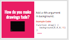
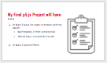
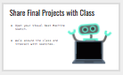

<header title='Showcase Final Project' subtitle='Lesson 7'/>

<notable>

<iconp src='/icons/activity.png'>### Overview</iconp>
Students finish thir Visual Beat Machine project and share it with the class.

<iconp src='/icons/objectives.png'>### Objectives</iconp>
- Students will be able to finish their Visual Beat Machine Project.

<iconp src='/icons/agenda.png'>### Agenda</iconp>
###### Total Length: 60 minutes
Participation: Whole Class

1. **Engage:** Example Code (2 minutes)
1. **Elaborate:** Finish Project (40 minutes)
1. **Showcase:** Share Processing Sketches with class (18 minutes)

<note>

<iconp src='/icons/materials.png'>### Materials</iconp>

###### Teacher Materials
- [ ] Projector
- [ ] Computer
- [ ] [Lesson 7 slideshow][slides]

###### Student Materials
- [ ] Computer
- [ ] pencils
- [ ] P5.js zine
- [ ] [Example Code][example]
- [ ] [Project Sounds][sounds]
- [ ] Student's Visual Beat Machine Final Project Sketch

</note>

<pagebreak/>
#### 1. Engage: Example Code (2 minutes)
- [ ] **Introduce** agenda for the day and example code for students to reference during project time.
  >> "Today you will finish your projects and share it with the class. During your project time, you can reference example code at tinyurl.com/p5code to help remind you of sketches we coded in previous classes."

<note>
**Slides:** </note>   

#### 2. Elaborate: Finish Project (40 minutes)
- [ ] **Review:** The 4th argument in background is alpha.
  >> "If we add a 4th argument to background() and background() is in function draw, the images on the screen will fade."

<note></note>   

- [ ] **Project:** Students log onto openprocessing and continue coding their visual beat machine projects.
  >> Remind students of the requirements of the project:
  - At least 3 ways for users to interact with sketch using keyPressed or mouse input.
  - At least 2 sound effects.

<note></note>

#### 3. Showcase: Share Processing Sketches with class (18 minutes)
- [ ] **Sharing:** Students open their project on their computer and walk around to view each other's Visual Beat Machines.
>> "You have all worked so hard these past few weeks to learn processing, now let's take sometime to interact and enjoy what you and your classmates have created!"

<note></note>

</notable>

[slides]: https://docs.google.com/presentation/d/1rba5FrkkljiApwfaAEzvD7G3Mamgy68tgEq8-48VCYw/edit
[sounds]: www.tinyurl.com/p5sounds
[example]: www.tinyurl.com/p5code
