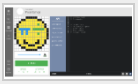
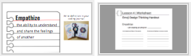
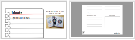
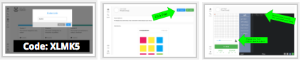
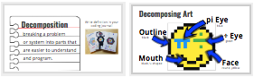

<header title='Designing Pixel Emojis' subtitle='Lesson 4'/>

<notable>

<iconp src='/icons/activity.png'>### Overview</iconp>
Students understand that computing is a creative experience and a tool for personal expression. In the next few lessons, students will design and create an emoji in pixelBots that they think a friend or family member will like. Today’s lesson will focus on designing how our pixel emoji will look.

<iconp src='/icons/objectives.png'>### Objectives</iconp>

- Students will be able to create a pixel emoji prototype on pixelBots.io using the design thinking process.
- Students will be able to decompose their prototype into features.

<iconp src='/icons/agenda.png'>### Agenda</iconp>
###### Total Length: 60 minutes
Two Group Lesson (groups switch 30 minutes into lesson):
1. **Independent Coding Time** (30 minutes)
  1. pixelBots playlists: Spicy & Extra Hot
1. **Group Instruction** (30 minutes)
  1. **Engage:** Math Eyed Emoji (2 minutes)
  1. **Explain/Elaborate:** Design Thinking (28 minutes)

<note>

<iconp src='/icons/materials.png'>### Materials</iconp>

###### Teacher materials
- [ ] Projector
- [ ] Computer
- [ ] [Lesson 4: Slideshow][slideshow]
- [ ] [Math Eyed Emoji][math] (code: XG31N)

###### Student materials
- [ ] Computer
- [ ] Pencils
- [ ] [Spicy playlist][spicy] (code: XL9LD)
- [ ] [Extra Hot playlist][extrahot] (code: VYGND)
- [ ] [Design Thinking Worksheet][worksheet]
- [ ] [Prototype Pixel Emoji][prototype] (code: XLMK5)

<iconp src='/icons/vocab.png'>### Vocabulary</iconp>

- **Empathy:** the ability to understand and share the feelings of another
- **Ideate:** generate ideas
- **Prototype:** a first functional form of a new design
- **Plan:** a detailed outline for doing or achieving something
- **Decomposition:** breaking a problem or system into parts that are easier to understand and program

</note>

<pagebreak/>
### 1. Independent Coding Time (30 minutes)

- [ ] **Independent Practice:** Students continue on pixelBots playlist from previous lesson. Students choose from:
  - Spicy - Code Link: XL9LD
  - Extra Hot - Code Link: VYGND

**Slides:**

<note type="tip" title="Tip">
1. Explain two groups to whole class.
1. Assign who will be in Independent Coding Time group.
1. Give instructions to Independent Coding Time group. Split into groups.
1. Lead lesson with 1st group, then switch.</note>

### 2. Group Instruction
#### i. Engage: Math Eyed Emoji (2 minutes)
**Participation:** Small group with instructor
- [ ] **Introduce Pixel Emoji Project** with Math Eyed Emoji on pixelBots (code: XG31N).
  >>"Today you will design your very own pixel emoji! In the following weeks you will code toucan to paint your emoji in pixelBots and on the last Saturday of devY art you get to showcase your emoji."

<note>**Slides:**</note>

<pagebreak/>
#### ii. Explain: Design Thinking (28 minutes)

- [ ] Pass out [Design Thinking Worksheet][worksheet]
- [ ] **Define** Empathize
  - **Modeling:** Teacher thinks of a person he/she wants to create an emoji for and fills out Empathize section of worksheet on the whiteboard while thinking out loud.
    >>"I am creating an emoji for my dad."
    >>
    >>"My dad likes reading, math and basketball."
    >>
    >>"What I want to convey in this emoji might be my dad’s love for reading, how he always thinks about math, and the feeling of watching his favorite basketball team winning"

<note></note>

- [ ] **Independent Exploration:** Students fill out Empathize section.

- [ ] **Define** Ideate
  -  **Modeling:** Teacher writes ideas for emojis and sketches some ideas in the Ideate section of worksheet.
    >>“A book, a face with math symbols, excited face, basketball”

<note></note>

- [ ] **Independent Exploration:** Students fill out Ideate section and sketch what their emoji might look like.

- [ ] **Define** Prototype
  - **Modeling:** Show prototype of math face emoji on pixelBots (code: XG31N).

<note></note>

- [ ] **Independent Exploration:** Students prototype their favorite pixel emoji idea on pixelBots. Guide students how to get to the emoji prototype challenge (code: XLMK5).
<note></note>

<pagebreak/>
- [ ] **Define** Decomposition
  - **Modeling:** Go through Decomposing Art slide and show how to use comments in pixelBots.
<note></note>

- [ ] **Independent Exploration:** Students decompose their emoji by writing comments in pixelBots.
<note></note>
>>“Our decomposed emoji will be the plan of how we code our emoji in pixelBots.”

- [ ] **Turn and Talk:** In pairs, students share their prototype.

</notable>
[example]: https://drive.google.com/file/d/0BzdzqwuMjqy2eHNkTmVqaFlCbmM/view
[slideshow]: https://docs.google.com/presentation/d/1kjonpZV1Gy4ezLT_4GQlyepL7OsTSVRCtnoFLSjhd1k/edit?usp=sharing
[worksheet]: ../../worksheets/lesson4-worksheet1-1.pdf
[math]: https://www.pixelbots.io/XG31N
[spicy]: https://www.pixelbots.io/XL9LD
[extrahot]: https://www.pixelbots.io/VYGND
[prototype]: https://www.pixelbots.io/XLMK5
