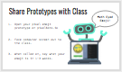
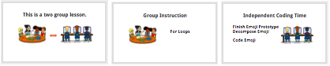
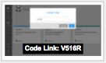
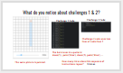
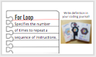
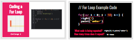
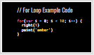

<header title='For Loops' subtitle='Lesson 5'/>

<notable>

<iconp src='/icons/activity.png'>### Overview</iconp>
Students are introduced to for loops in javascript on pixelBots.io. Students will begin to code their Pixel Emoji Projects and will be able to use for loops to replace a long, repetitive sequence of code.

<iconp src='/icons/objectives.png'>### Objectives</iconp>
- Students will be able to read a for loop in javascript.
- Students will be able to modify the condition statement and chunk of code in a given for loop to meet the needs of their project.

<iconp src='/icons/agenda.png'>### Agenda</iconp>
###### Total Length: 60 minutes
Two Group Lesson (groups switch halfway):
1. **Whole Class** (4 minutes)
  1. **Engage:** Pixel Emoji Projects
1. **Independent Coding Time:** Pixel Emoji (28 minutes)
  1. Finish Prototype
  1. Decompose
  1. Code
1. **Group Instruction:** For Loops (Total: 28 minutes)
  1. **Explore:** Introduction (15 minutes)
  1. **Explain:** Syntax (5 minutes)
  1. **Elaborate:** Writing (8 minutes)

<note>

<iconp src='/icons/materials.png'>### Materials</iconp>

###### Teacher materials
- [ ] Projector
- [ ] Computer
- [ ] [Lesson 5: Slideshow][slideshow]

###### Student materials
- [ ] Computer
- [ ] Pencils
- [ ] [Lesson 5 | For Loops][loops] Playlist (code: V516R)
- [ ] Student's Emoji Prototype (on pixelBots account)

<iconp src='/icons/vocab.png'>### Vocabulary</iconp>
- **For-Loop:** Specifies the number of times to repeat a sequence of instructions.

</note>
<pagebreak/>
#### 1. Engage: Pixel Emoji Projects (4 minutes)
###### Participation: Whole Class

 
- [ ] **Share out:** Students open their Pixel Emoji Projects on pixelBots.io and turn their computers to face the class. Call on students to share what their emoji is using 1 or 2 words. Every student should be able to share.
  >>"Today you will code your pixel emojis! Before we start, let’s take a quick look at everyone’s emoji prototype."

<note type="tip" title="Tip">
Keep this quick and snappy to build excitement.

**Slides:**

</note>

- [ ] **Review** two groups and split class.
  >>“It’s great to see everyone’s project! Today will be another two group lesson. During Independent Coding Time you will begin coding your emoji on pixelBots. In our Group Instruction we will learn about for loops.”

<note>
</note>

#### 2. Independent Coding Time: Pixel Emojis (28 minutes)

- [ ] **Project:** Students continue working on emoji project.
  1. Finish pixel emoji prototype
  1. Decompose emoji and write a comment for each feature.
    - Example:
      - // pi eye - blue
      - // division eye - green
      - // mouth - black
  1. Code one feature at a time.
<note type="reminder" title="Reminder">
- Remind students how to decompose their emoji. Each decomposed part should be a single color.
- Remind students to code the simple features first.
    </note>

<pagebreak/>
#### 3. Group Instruction: For Loops
#### i. Explore: Introduction (15 minutes)

- [ ] **Explore:** Students do [Lesson 5 | For Loops][loops] playlist on pixelBots (code: JD3E8)
  - Challenge 1 and 2 are the same, but 2 is done for them using a for loop.
    - Put slide 7 up after students have completed 1 & 2.
    - Ask students to respond to the question in their coding journals.
  - Circulate the room, and narrate what students are doing for challenge.
    >> Suggested Narration:
      * "__________ is attempting to write a for loop."
      * "___________ completed challenge 3, using a for loop."
      * "___________ copied and pasted the given for loop and is changing the code inside the for loop."
      * "_________ is changing the number in the for loop."

<note type="tip" title="Tip">
Students will not get through all challenges. Once every student has had a chance to try challenge 3 for 2-3 minutes, quickly move to discussing challenges 1 & 2.

**Slides:**
</note>

- [ ] **Discuss:** Challenges 1 & 2, code without for loop and code with for loop.
  <iconp type='question'>What do you notice about challenges 1 & 2? </iconp>
  <iconp type='answer'>The same picture is painted.</iconp>
  <iconp type='answer'>Challenge 2 code uses less lines of code than 1.</iconp>
  <iconp type='answer'>The bot moves in a pattern: down, paint, down paint, …</iconp>
  <iconp type='question'>How many times does this sequence of instructions repeat?</iconp>
  <iconp type='answer'>9 times</iconp>
 

<note>
</note>

- [ ] **Explore:** Students continue working on playlist for 5-8 minutes.

- [ ] **Share out:** Have 1-3 students define For Loop in their own words before showing the definition slide.

<pagebreak/>
#### ii. Explain: Syntax (5 minutes)

- [ ] **Define** For-Loop: specifies the number of times to repeat a sequence of instructions.
  >> “We can write a for loop to repeat a sequence of code ____ amount of times.”

<note>
**Slides:**
</note>

- [ ] **Model** for loop on challenge 3 through gif on slide.
  >>"Two for loops can be used to complete this challenge. One for loop is written for you."

- [ ] **Identify** key parts of for loop.
<iconp type='question'>What code is being repeated?</iconp>
<iconp type='answer'>right(1) & paint(‘amber’)</iconp>
<iconp type='question'>How many times does it repeat?</iconp>
<iconp type='answer'>10 times</iconp>

  >>“For your projects, you will write your for loop like this example code, but change what code is repeated and how many times it repeats.”

<note type="key" title="Key">
Main take away on For Loops:
  1. Know how many times the For Loop repeats.
  1. Know what code is being repeated.

**Slides:**
</note>

- [ ] **Motivate** students to use for loops in their pixel emoji projects.
  >> "For loops are a powerful tool that you can use in your project. Instead of repeating lines of code, you can write a for loop to repeat code for you."

<note type="reminder" title="Reminder">
This is an introductory lesson. It is not necessary they fully understand each part of the for loop (initialization, condition statement, and iteration statement).</note>

#### iii. Elaborate: Writing (8 minutes)

- [ ] **Project:** Students code one feature at a time of their emoji using for loops.
  - After students begin working, put example for loop slide up for students to reference.

<note>
**Slides:**
</note>

</notable>
[loops]: https://www.pixelbots.io/JD3E8
[slideshow]: https://docs.google.com/presentation/d/1ClzDzGM1ShCJpNNZcM-FleByDO7g058BWbKO77rcsfo/edit?usp=sharing
