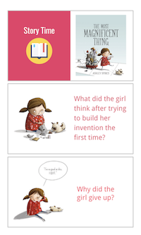
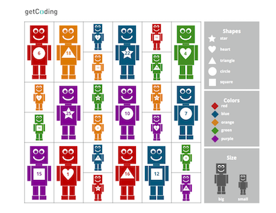

<header class='header' title='Mystery Robot' subtitle='Lesson 01'/>

<notable>
<iconp src='/icons/activity.png'>### Overview</iconp>
In lesson 1 students are introduced to the concept of productive failure through a story about a little girl and her quest to build a magnificent machine. Students discuss their takeaways from the story and apply the productive failure mindset to solve a mystery.

<iconp src='/icons/objectives.png'>### Objectives</iconp>
- I can identify what I learned from my mistakes.

<iconp src='/icons/agenda.png'>### Agenda</iconp>

1. Engage: The Most Magnificent Thing (10 min)
1. Explore: Mystery Robot (5 min)
1. Explain: Process of Elimination (3 min)
1. Elaborate: Mystery Robot Round 2 (7 min)
1. Evaluate: Debrief (5 min)

<note>
<iconp src='/icons/materials.png'>### Materials</iconp>
###### Teacher Materials:
- [ ] Computer
- [ ] Projector
- [ ] *The Most Magnificent Thing*
- [ ] [Robot Cards][robot-cards]
- [ ] [Slide Show][slide-show]

###### Student Materials:
- [ ] Dry Erase Markers
- [ ] [Robot Boards][robot-boards]

</note>

<pagebreak/>

## Room Design

<note borderLeft='2px solid green' mt='2em'>
###### Symbols Key

<iconp ml='1.65em' type='question'>question</iconp>
<iconp ml='1.65em' type='answer'>answer</iconp>
- [ ] action item
</note>

<pagebreak/>
## 1. Engage: *The Most Magnificent Thing* (10 min)

- [ ] **Read** *The Most Magnificent Thing* while stopping to ask the class questions.

<iconp type='question'>Page 8: What did the girl do after trying to build her invention the first time?</iconp>
<iconp type='answer'>The girl saw that her invention does not work and tried again.</iconp>

<iconp type='question'>Page 22: Why did the girl give up?</iconp>
<iconp type='answer'>The girl gave up because she tried to build her invention many times and she thinks she can’t do it.</iconp>

<note></note>

<iconp type='question'>Page 26: What did the girl notice about each one of the inventions?</iconp>
<iconp type='answer'>The girl noticed that some of the inventions she thought were no good had parts that she liked.</iconp>

<iconp type='question'>Page 29: What did the girl learn about making mistakes?</iconp>
<iconp type='answer'>The girl learned that you can learn from your mistakes?</iconp>

- [ ] **Discuss** the message the book sends with the class.

<iconp type='question'>What did you learn about giving up from this story?</iconp>

- [ ] **Explain** how the story relates to coding.
>> “When we begin coding we will make mistakes and that is ok because we can always learn from our mistakes. Even the best coders in the world make mistakes. Just like the girl in the story you may want to give up when you make a mistake, but the important thing to remember is that we can always learn from our mistakes as long as we do not give up and continue to try.”

<note></note>

## 2. Explore: Mystery Robot (5 min)
- [ ] **Introduce** the Mystery Robot game.
>> “We are going to play a game in which we are going to solve a mystery. I am going to select one of the robots you see on the board from my deck of cards. You will all then try to figure out which robot I have selected by asking me about the robot’s size, color, shape, or number.”

- [ ] **Model** how to ask questions about the robot’s attributes.
>> “When we ask a question about the robot we want to ask questions about its shape, color, number, or size. Some robots have hearts, some have stars, some are red, some are blue, some are big and some are small. We want to identify the mystery robot by asking questions like, is the mystery robot red?  We can also ask, if the mystery robot is number 8? We also ask if the mystery robot has a triangle shape?”

- [ ] **Model** how to eliminate possibilities.
>> “By asking questions we can learn more about the robot. If I think the robot is red I can ask, ‘Is the mystery robot red?’ If the answer to that question is ‘No, the robot is not red’, I may have made a mistake by thinking the robot is red, but I still learned something from my mistake. I now know that the mystery robot is not red and I can cross off all of the red robots from my board.”

- [ ] **Show** the class how to eliminate possibilities from their board using the dry erase marker.

- [ ] **Play** the Mystery Robot game as a class.

## 3. Explain: Productive Failure (10 min)
- [ ] **Share Out:** Students discuss their observations from playing the game.

<iconp type='question'>What have you noticed that you have been able to do on your board after each person asks a question?</iconp>

- [ ] **Share Out:** Students discuss their ideas

<iconp type='question'>Why do you think you have been able to cross robots off your board each time a question is answered?</iconp>

- [ ] **Explain** that each response to a question is a learning opportunity even if the question was based on an idea that was wrong.
>> “We are able to cross robots off our board each time a question is asked because we can always learn something new from the information we receive, even if our original idea is wrong. For example, if I think that the mystery robot is green I can ask ‘Is the mystery robot green?’ If the robot is not green I still learned something new because I can now cross off all of the green robots even though my idea of the robot’s color was wrong. This information gets me a little closer to finding out which robot is the mystery robot.”

## 4. Elaborate: Mystery Robot Round 2 (7 min)
- [ ] **Remind** students of the attributes they can ask about in the Mystery Robot game.
>> “We are going to play another round of the Mystery Robot game. Remember, you can ask about the robot’s size, shape, color, and number.”

- [ ] **Remind** the class to look for robots they can cross off their board after each question is asked.
>> “After each person asks a question about the mystery robot look for robots that you can cross off of your board.”

- [ ] **Play** another round of the Mystery Robot game as a class.

## 5. Evaluate: Debrief (3 min)
- [ ] **Remind** students of the lesson that was learned from reading The Most Magnificent Thing.
>> “When we read The Most Magnificent Thing we learned that it is possible for us to learn from our mistakes as long as we don’t give up.”

- [ ] **Turn and Talk:** Students discuss how the lesson they learned from The Most Magnificent Thing helped them play the mystery robot game.

<iconp type='question'>How was the lesson we learned about making mistakes and not giving up helpful in playing the game?</iconp>

- [ ] **Share Out:** Students share their responses to the turn and talk question with the class.

</notable>

[slide-show]: https://drive.google.com/open?id=1bIGou3ARKNB78DqcmsXUgywcwctqkx-pHWLKNK5IzpU
[robot-boards]: https://drive.google.com/open?id=0B48_2vIyABioa0Z0WXFfbFllaGc
[robot-cards]: https://drive.google.com/open?id=0B48_2vIyABioRWN5b2ZtM0JWcE0
