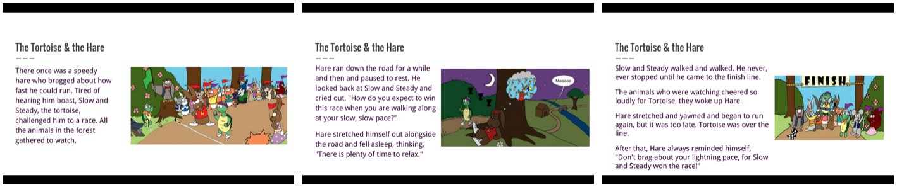

<header class='header' title='Summarizing I' subtitle='Lesson 11'/>

<notable>
<iconp src='/icons/activity.png'>### Overview</iconp>
In lesson 11 students are introduced to summaries. Students practice summarizing code by stepping through pixelBot sequences that produce images on a grid. Students use the images and summarize them verbally using sentence stems.

<iconp src='/icons/objectives.png'>### Objectives</iconp>
- I can summarize my code.

<iconp src='/icons/agenda.png'>### Agenda</iconp>
1. Engage: Story Time (5 min)
1. Explore: Pixel Bot Summary (2 min)
1. Explain: Summaries (8 min)
1. Elaborate: Step and Paint Summaries (15 min)

<note>
<iconp src='/icons/materials.png'>### Materials</iconp>
###### Teacher Materials:
- [ ] Computer
- [ ] Projector
- [ ] [Slide Show][slides]

###### Student Materials:
- [ ] Dry Erase Markers
- [ ] [Explore Link][link]
- [ ] [Worksheets][worksheet]
- [ ] [Tokens][token]

<iconp src='/icons/vocab.png'>### Vocabulary</iconp>
**Summary** - A short statement that gives the most important information about something.

</note>

<pagebreak/>

## Room Design

<note borderLeft='2px solid green' mt='2em'>
###### Symbols Key

<iconp ml='1.65em' type='question'>question</iconp>
<iconp ml='1.65em' type='answer'>answer</iconp>
- [ ] action item
</note>

<pagebreak/>

## 1. Engage: Story Time (5 min)
- [ ] **Read** The Tortoise and the Hare and have students summarize the story verbally. (4 min)

<iconp type='question'>What happened in the story?</iconp>
<iconp type='answer'>The tortoise beat the hare in a race.</iconp>

- [ ] **Define** the word summary. (2 min)
	>> “Sometimes it is helpful to describe something in a short and simple way that gives you the most important information. This is what we call a summary. When I asked you to tell me what happened in the story you summarized the story by only telling me the most important part. The pictures in the story are also examples of summaries because they give you only the most important information about the story. Today we are going to learn how to summarize code.”

- [ ] **Explain** the importance of learning to summarize code.
	>> "Learning to summarize code is important because it allows us to identify what our code does."

## 2. Explore: Pixel Bot Summary (2 min)
- [ ] **Independent Exploration:** Students observe pre-written code in action. (1 min)
	- [ ] Have students click run on the Explore challenge and observe what the Pixel Bot draws.
- [ ] **Turn and Talk:** Students summarize the result of the code with a partner. (1 min)
	- [ ] Have students turn to a partner and summarize the result of the code by using the sentence stem below.
	>> "The sequence makes the bot paint a letter E."

## 3. Explain: Summaries (8 min)
- [ ] **Model** stepping and summarizing a sequence of code. (4 min)
	 - [ ] Project slide 6 on the whiteboard and place the token on the start square.
	 - [ ] Use the check and move protocol to step through the code. As you step, color squares with a dry erase marker according to the code.
	 - [ ] **Summarize** the code using the sentence stem students will use.
	 >> “The sequence makes the bot paint the letter H.”

- [ ] **Guided Practice:** Students step through code and summarize the result of the code verbally. (4 min)
	- [ ] Project slide 7 on the whiteboard and place the token on the start square. Have students do the same on their laminated grid.
	- [ ] Step through the first 4 lines on the board and have students step through the rest.
	- [ ] **Turn and Talk:** Have students summarize the code with a partner using the sentence stem.
	>> “The sequence directs the bot to paint the letter P.”

-  [ ] **Review** the solution to the problem by stepping through the rest of the sequence and sharing your summary.

## 4. Elaborate: Step and Paint Summaries (15 min)
- [ ] **Independent Practice:** Students practice stepping through code to produce pixel images using the lesson 11 worksheet. (10 min)
- [ ] **Share Out:** Students share their summaries of the code’s output verbally with the class. (5 min)

</notable>

[slides]: https://docs.google.com/presentation/d/16PE8nacAWXxVLLD4ceMgj1Cz_GCG9cqgLQ84oUo3MZo/edit#slide=id.p
[link]: http://www.pixelbots.io/VYGL7
[worksheet]: https://drive.google.com/open?id=0B48_2vIyABioaDJvaE9zWEJRMnc
[token]: https://drive.google.com/open?id=0B48_2vIyABioWmsyY1hPSmpmMXM
