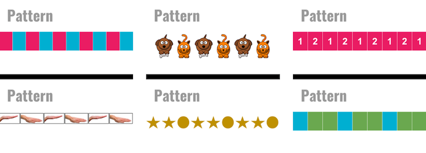
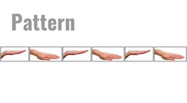
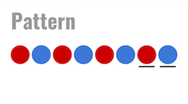
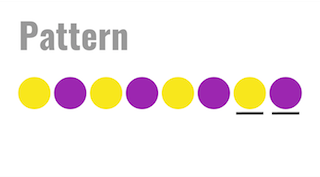
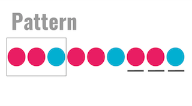

<header class='header' title='Identifying Patterns' subtitle='Lesson 15'/>

<notable>
<iconp src='/icons/activity.png'>### Overview</iconp>
Lesson 15 introduces students to patterns in preparation to learn how to loop code. Through exploration students develop their own definition of a pattern and learn to identify the repeating sequence within a pattern.

<iconp src='/icons/objectives.png'>### Objectives</iconp>
- I can complete a pattern.
- I can identify the core of a pattern.

<iconp src='/icons/agenda.png'>### Agenda</iconp>

1. Engage: Pat-terns (2 min)
1. Explore: What are Patterns? (5 min)
1. Explain: Identify the Pattern (10 min)
1. Elaborate: Independent Practice (13 min)

<note>
<iconp src='/icons/materials.png'>### Materials</iconp>
###### Teacher Materials:
- [ ] Computer
- [ ] Projector
- [ ] [Slide Show][slides]

###### Student Materials:
- [ ] [Patterns Worksheet][worksheet]
- [ ] Color Pencils
- [ ] Pencils

<iconp src='/icons/vocab.png'>### Vocabulary</iconp>
- **Pattern** - A sequence that repeats more than once.

</note>

<pagebreak/>

## Room Design

<note borderLeft='2px solid green' mt='2em'>
###### Symbols Key

<iconp ml='1.65em' type='question'>question</iconp>
<iconp ml='1.65em' type='answer'>answer</iconp>
- [ ] action item
</note>

<pagebreak/>

## 1. Engage: Pat-terns (2 min)
- [ ] **Introduce** the word pattern and have students practice pronouncing it.
>> "Today we are learning about patterns. Repeat after me, pat-terns."

## 2. Explore: What are Patterns? (5 min)
- [ ] **Present** examples of patterns.
>> “Each of the following pictures is an example of a pattern. See if you can find what they all have in common.”

- [ ] **Turn and Talk:** Pairs discuss the commonalities among the examples.
<iconp type='question'>What do all of the examples have in common?</iconp>

- [ ] **Share Out:** Volunteers share out their observations.

- [ ] **Turn and Talk:** Pairs define the word pattern based on their observations.
<iconp type='question'>What do you think a pattern is?</iconp>

- [ ] **Share Out:** Pairs share out their definition of the word pattern.

## 3. Explain: Identify the Pattern (10 min)
- [ ] **Define** pattern.
>> “In each of the examples you just saw something was repeating. A pattern is a repeating sequence.”

- [ ] **Demonstrate** the pattern hand signal.

- [ ] **Practice:** Have students practice repeating the hand signal while saying the word.

- [ ] **Model** completing a color pattern by saying the colors out loud rhythmically.
>> “I have to complete the pattern by coloring in the final two circles. To find out which colors they should be I will look for a pattern. The colors are red, blue, red, blue, red, blue. So the next two circles are red and blue.”

- [ ] **Guided Practice:** The class works together to complete a set of patterns.
>> “Let’s say the colors we see in order out loud. yellow, purple, yellow. purple, yellow, purple.”

<iconp type='question'>What colors should the next two circles be?</iconp>

- [ ] **Model** completing the pattern and identifying the repeating sequence.
>> “In order to find the repeating sequence of the pattern, I want to look for the beginning and ending of the sequence. We can call the repeating sequence in the pattern the core. This example shows red, red, blue, red, red, blue. So the core begins at red and ends with blue. To show this I will box the three circles starting at red and end with the blue one.”

- [ ] **Guided Practice:** completing the pattern and identifying the repeating sequence.
>> “Let’s try one together. Say the colors with me. Red, yellow, blue, red, yellow, blue. “

<iconp type='question'>What colors should come next to complete the pattern?</iconp>
<iconp type='question'>Where does the core of the pattern begin and where does it end?</iconp>

## 4. Elaborate: Independent Practice (13 min)
- [ ] **Explain** how to complete the patterns worksheet with problem number 1.
>> “In each of the problems on the worksheet we are going to (1) complete the pattern and (2) circle the core. Problem number 1 shows the pattern blue, red, blue, red.”

<iconp type='question'>What colors should the next two circles be?</iconp>

- [ ] **Demonstrate** how to complete the patterns worksheet.
>> “Since the next two colors should be blue and red, I will color them in with my color pencils and circle the core.”

<iconp type='question'>Where does the core begin and where does it end?</iconp>

- [ ] **Independent Practice:** Students complete the patterns worksheet.
- [ ] **Monitor** the room for students in need of additional assistance.
- [ ] **Review** examples 3, 8 and 12 with the class.
- [ ] **Debrief** the lesson.

<iconp type='question'>What two things did we learn to do today?</iconp>
<iconp type='answer'>Today we learned how to (1) complete a pattern and (2) identify its core.</iconp>

</notable>

[slides]: https://docs.google.com/presentation/d/1WesquT9S_aw8CzzoQCw0iuu6xflkTiF4zAyBxLB6RN4/edit#slide=id.p
[worksheet]: https://drive.google.com/file/d/0B48_2vIyABioWjJyc0Z1c2dRelk/view
