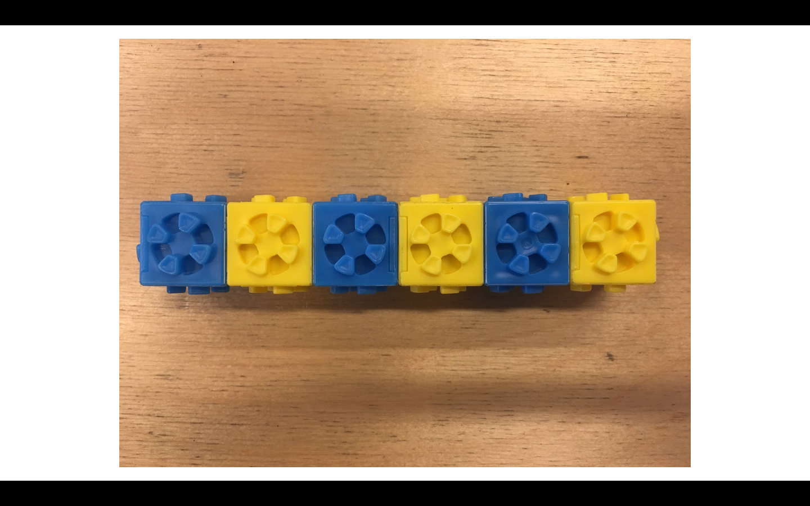
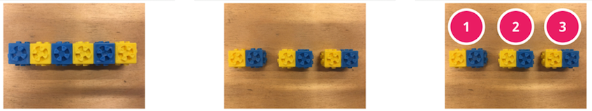
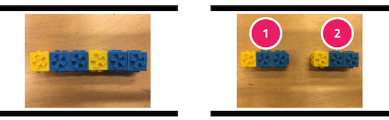

<header class='header' title='Repeating Patterns' subtitle='Lesson 16'/>

<notable>
<iconp src='/icons/activity.png'>### Overview</iconp>
In lesson 16  students learn to identify the number of times the core repeats within a pattern through decomposition. The lesson begins with a review of identifying the core of a pattern. Students then explore decomposing color patterns with omnifix cubes and practice with a worksheet.

<iconp src='/icons/objectives.png'>### Objectives</iconp>
- I can decompose a pattern to identify the number of times its core repeats.

<iconp src='/icons/agenda.png'>### Agenda</iconp>

1. Engage: Patterns Review (6 min)
1. Explore: Decomposing Patterns (4 min)
1. Explain: Repeating Patterns (8 min)
1. Elaborate: Independent Practice (12 min)
1. Extension: Writing Patterns

<note>
<iconp src='/icons/materials.png'>### Materials</iconp>
###### Teacher Materials:
- [ ] Computer
- [ ] Projector
- [ ] [Slide Show][slides]

###### Student Materials:
- [ ] [Patterns Worksheet][worksheet]
- [ ] Omnifix Cubes
- [ ] Pencils
</note>

## Room Design

<note>
<iconp src='/icons/vocab.png'>### Vocabulary</iconp>
- **Pattern** - A sequence that repeats more than once.
</note>

<pagebreak/>

## 1. Engage: Patterns Review (6 min)
- [ ] **Review** the word pattern by having students repeat the word while doing the pattern hand signal.

- [ ] **Turn and Talk:** Show students examples of patterns and have them discuss what a pattern is with a partner.

<iconp type='question'>What is a pattern?</iconp>

- [ ] **Share Out:** Students share their definition of the word pattern.

- [ ] **Show** a pattern and have students help complete it.
>> “I need help completing this pattern. The pattern goes red, red, yellow, red, red, yellow.”

<iconp type='question'>What should come next in the pattern?</iconp>

- [ ] **Challenge** the class to help you identify the core of the pattern.
>> “I need your help finding the core of this pattern.”

<iconp type='question'>Where does the core begin?</iconp>
<iconp type='question'>Where does the core end?</iconp>

## 2. Explore: Decomposing Patterns (4 min)
- [ ] **Demonstrate** how to build a pattern using omnifix cubes and have students copy the pattern you create.

- [ ] **Challenge** the class to identify the core of the pattern by breaking it off from the rest of the omnifix cube sequence.

- [ ] **Share Out:** Have volunteers share the core they identified with the class.

- [ ] **Challenge** the class to decompose the rest of the omnifix cube sequence into its core units.

- [ ] **Turn and Talk:** Students discuss the number of times the core repeats in the pattern and how they figured it out.

<iconp type='question'>How many times does the core repeat in the pattern we created?</iconp>
<iconp type='question'>How do you know?</iconp>

- [ ] **Share Out:** Students share their answers with the rest of the class.

## 3. Explain: Repeating Patterns (8 min)
- [ ] **Model** decomposing patterns and counting the number of times the core repeats.
>> “To decompose this pattern I first want to try to identify the core. The pattern goes blue, yellow, blue, yellow, blue, yellow. The part that repeats includes one blue block and one yellow block. Now I can break my pattern apart into its core units that have one blue block connected to one yellow block. To see how many times the core repeats I simply count the number of pieces I’m left with. This sequence repeats 3 times in the pattern because there are 3 pieces left.”

- [ ] **Guided Practice:** Have the class practice identifying the core.
>> “Build the pattern you see on the board. Let’s say the colors we see in the pattern starting with the color yellow. Yellow, blue, blue, yellow, blue, blue”

<iconp type='question'>What is the core of the pattern?</iconp>
<iconp type='answer'>The core of the pattern is yellow, blue, blue.</iconp>

- [ ] **Guided Practice:** Have the class practice decomposing the pattern.
>> “Now let’s decompose our pattern into its core units. Break off the pieces that have a yellow block connected to two blue blocks.”

- [ ] **Guided Practice:** Have the class practice identifying the number of times the core repeats.
>> “To find the number of times the core repeats, let’s count the number of pieces we are left with.”

<iconp type='question'>How many pieces are we left with?</iconp>

## 4. Elaborate: Independent Practice (12 min)
- [ ] **Explain** how to complete side one of the patterns worksheet.
>> “Let’s practice finding the number of times a core repeats. To complete the first side of the worksheet we are going to circle each time the core repeats in the pattern. Then we will count the number of circles we made and write that number above the pattern.”

- [ ] **Demonstrate** how to complete side one of the patterns worksheet.
>> “The pattern in problem one shows the colors blue, green, blue, green, blue, green. The core of this pattern is blue and green. I will circle the each blue and green core. Then I count the number of circles I have. One, two, three. Since the core repeats 3 times I will write the number 3 above the pattern.”

- [ ] **Independent Practice:** Students work on side one of the patterns worksheet.

- [ ] **Monitor** the room for students in need of additional assistance.

- [ ] **Review** 1-3 problems on the board.

- [ ] **Debrief** the lesson.

<iconp type='question'>What did we learn to do today?</iconp>
<iconp type='answer'>Today we learned how to identify the number of times the core repeats in a pattern.</iconp>

## 5. Extension: Writing Patterns
- [ ] **Explain** how to complete side two of the patterns worksheet.
>> “On side two of the worksheet we are doing the opposite of what we did on side one. This time we are given a core and the number of times it should repeat. We will use that information to continue the pattern.”

- [ ] **Demonstrate** how to complete side two of the patterns worksheet.
>> “Problem nine shows a core of two blocks. One is blue and one is green. It also shows that the pattern should repeat two times. If I draw and color the blue and green core one more time I will have a pattern that repeats two times.”

- [ ] **Independent Practice:** Students work on side two of the patterns worksheet.

- [ ] **Monitor** the room for students in need of additional assistance.

</notable>
[slides]: https://docs.google.com/presentation/d/1kCH_UCJlKYdp3ves1yejJwh4Te6zCLs5IL9cxq3mJxE/edit#slide=id.p
[worksheet]: https://drive.google.com/file/d/0B48_2vIyABioTzBjM0xHZERVdnc/view
