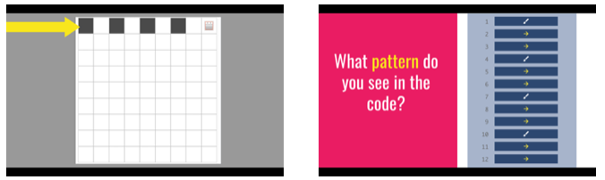
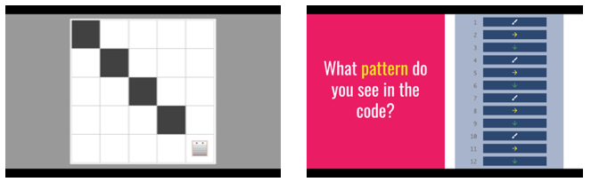
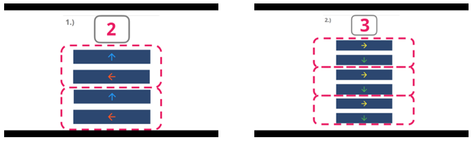

<header class='header' title='Patterns in Code' subtitle='Lesson 17'/>

<notable>
<iconp src='/icons/activity.png'>### Overview</iconp>
In lesson 17 students learn to identify patterns and the number of times their core repeats in the context of pixelBot code. The lesson begins with the class making connections between a pattern in the movements of a pixelBot and a pattern in its corresponding code. Students then learn to identify the core of a pattern and the number of times it repeats in a sequence of code.

<iconp src='/icons/objectives.png'>### Objectives</iconp>
- I can identify a pattern in my code.
- I can identify the number of times the core of a pattern repeats in my code.

<iconp src='/icons/agenda.png'>### Agenda</iconp>

1. Engage: Patterns Review (4 min)
1. Explore: pixelBot Patterns (4 min)
1. Explain: Patterns in Code (10 min)
1. Elaborate: Independent Practice (12 min)

<note>
<iconp src='/icons/materials.png'>### Materials</iconp>
###### Teacher Materials:
- [ ] Computer
- [ ] Projector
- [ ] [Slide Show][slides]

###### Student Materials:
- [ ] [Patterns Worksheet][work]

<iconp src='/icons/vocab.png'>### Vocabulary</iconp>
- **Pattern** - A sequence that repeats more than once.

</note>

<pagebreak/>

## Room Design

<note borderLeft='2px solid green' mt='2em'>
###### Symbols Key

<iconp ml='1.65em' type='question'>question</iconp>
<iconp ml='1.65em' type='answer'>answer</iconp>
- [ ] action item
</note>

<pagebreak/>

## 1. Engage: Patterns Review (4 min)
- [ ] **Present** the review problem.

- [ ] **Turn and Talk:** Students examine a pattern and attempt to identify its core.

<iconp type='question'>What pattern do you see?</iconp>

- [ ] **Share Out:** Students share the core they identified.
- [ ] **Challenge** the class to identify the number of times the core repeats in the pattern.

<iconp type='question'>How many times does the core repeat?</iconp>

- [ ] **Share Out:** Students share the number of times the core repeats.

## 2. Explore: pixelBot Patterns (4 min)
- [ ] **Challenge** the class to identify a pattern in the pixelBot video.

- [ ] **Show** the pixelBot video.

- [ ] **Turn and Talk:** Students discuss the pattern they identified in the video.

<iconp type='question'>What pattern did you see in the video?</iconp>

- [ ] **Share Out:** Students share the pattern they identified in the video.

- [ ] **Show** students the sequence of code that directed the bot’s movement in the video.
- [ ] **Challenge** the class to identify a pattern in the sequence of code.

<iconp type='question'>What pattern do you see in the code?</iconp>

## 3. Explain: Patterns in Code (10 min)
- [ ] **Explain** that the images the bot colored are a representation of patterns in the code.
>> “In pixelBot we can create patterns in our bot's actions by coding patterns in the directions we give it. In the last video we saw a pattern that our bot painted because someone coded a pattern in its directions."

- [ ] **Challenge** the class to identify a pattern in the next video.
>> “In the next video we are going to try to find a pattern in the bot's actions. Then we are going to try to find a matching pattern in the code.”

- [ ] **Show** the pixelBot video.

- [ ] **Discuss** the patterns that students saw in the video.

<iconp type='question'>What was the pattern in the way the bot moved?</iconp>
<iconp type='question'>How many times did the bot repeat that pattern?</iconp>

- [ ] **Show** the class the the code the bot acted out.

- [ ] **Discuss** the patterns that students see in the code.

<iconp type='question'>What pattern do you see in the code?</iconp>
<iconp type='question'>How many times does the core of the pattern repeat?</iconp>

- [ ] **Model** completing problem number one on the patterns worksheet and have students copy the answer.
>> “The directions in this code are up, left, up, left. It looks like the core is up, left. To show that this is the repeating sequence I am going to box it. Then I will box the next two blocks that continue the pattern. Now that I’ve boxed them all, I will count the number of boxes I made to show the number of times the core repeats and write the number at the top.”

- [ ] **Guided Practice:** The class works together to identify the core in problem number two.
>> “Let’s say the directions we see in this sequence out loud together. Right, down, right, down, right, down.”

<iconp type='question'>What is the core of this pattern?</iconp>

- [ ] **Guided Practice:** The class works together to find the number of times the core repeats in the code.
>> “Let’s put a box around the first sequence that shows right and left and then do the same for all of the following right-down sequences.”

<iconp type='question'>How many times does the core repeat?</iconp>

## 4. Elaborate: Independent Practice (12 min)
- [ ] **Independent Practice:** Students work on the patterns worksheet independently.

- [ ] **Monitor** the room for students in need of additional assistance.

- [ ] **Review** 2-3 problems from the worksheet.

- [ ] **Debrief** the lesson.

<iconp type='question'>What did we learn to do today?</iconp>
<iconp type='answer'>Today we learned how to find patterns in our code and identify the number of times they repeat.</iconp>

</notable>

[slides]:https://docs.google.com/presentation/d/1IF7LIc89084H5o6ADTDlLF7wa-EL0sVVGyAVNJMAKIU/edit#slide=id.g1ef20f4d27_0_37
[work]: https://drive.google.com/file/d/0B48_2vIyABioWTBQbFJ1em15MjQ/view
