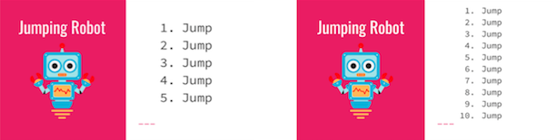
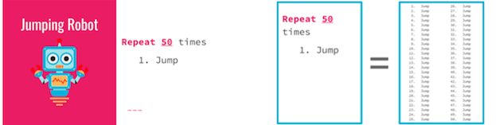
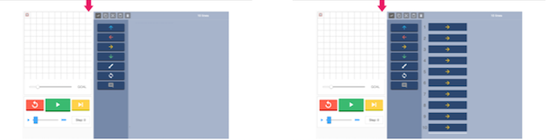
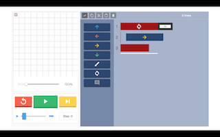
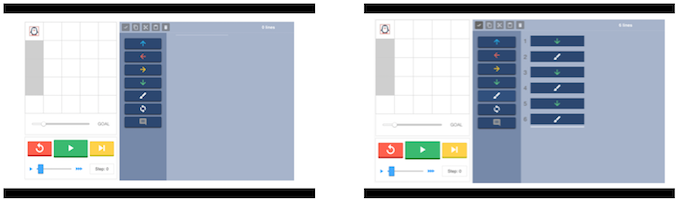
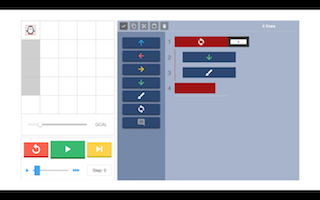

<header class='header' title='Writing Loops' subtitle='Lesson 18'/>

<notable>
<iconp src='/icons/activity.png'>### Overview</iconp>
In lesson 18 students learn to write loops on the pixelBot platform. Students use their ability to identify the core of a pattern and the number of times it repeats to refactor sequences of code with loops.

<iconp src='/icons/objectives.png'>### Objectives</iconp>
- I can loop a sequence of code.

<iconp src='/icons/agenda.png'>### Agenda</iconp>

1. Engage: Jumping Robot (8 min)
1. Explore: Find the Pattern (5 min)
1. Explain: Repeat the Pattern (7 min)
1. Elaborate: pixelBot Loops (10 min)

<note>
<iconp src='/icons/materials.png'>### Materials</iconp>
###### Teacher Materials:
- [ ] Computer
- [ ] Projector
- [ ] [Playlist: Intro to Loops][loops]
- [ ] [Slide Show][slides]

###### Student Materials:
- [ ] Computers
- [ ] [Playlist: Writing Loops][writing]

<iconp src='/icons/vocab.png'>### Vocabulary</iconp>
- **Loop** - A sequence of actions that is repeated.

</note>

<pagebreak/>

## Room Design

<note borderLeft='2px solid green' mt='2em'>
###### Symbols Key

<iconp ml='1.65em' type='question'>question</iconp>
<iconp ml='1.65em' type='answer'>answer</iconp>
- [ ] action item
</note>

<pagebreak/>

## 1. Engage: Jumping Robot (8 min)
- [ ] **Introduce** the jumping robot activity and ask for a volunteer to play the role of the jumping robot.
>> “We are going to play a game called jumping robot. In this game I will be a coder who will code a robot that can jump. The robot will follow the directions I give it in the code on the board. The only direction the robot can understand is jump. Would anyone like to volunteer to be the jumping robot?”

- [ ] **Show** the first two sequences of code and have the jumping robot act them out.

- [ ] **Explain** that in the next sequence of code you want the jumping robot to jump 50 times, but writing the direction 50 times will take too much time.

- [ ] **Challenge** the class to try to think of a different way to tell the jumping robot to jump.

<iconp type='question'>What is another way we can make the robot jump 50 times without having to say jump 50 times?</iconp>

- [ ] **Explain** that instead of writing the jump direction 50 times it is possible to simply tell the jumping robot to repeat the jump command 50 times.

- [ ] **Show** that the sequence of code with 50 jump commands is the same as the sequence of code that tells the robot to repeat the jump command 50 times.

## 2. Explore: Find the Pattern (5 min)
- [ ] **Explain** that code can be repeated just like in the jumping robot example.

- [ ] **Show** pixelBot challenge number one and have the class help you write the code.
>> “In this challenge we want to get out pixelBot to the square that the arrow is pointing to. What directions should I code for my pixelBot?”

- [ ] **Explain** that the code can be shortened by telling the computer to repeat the direction that we see repeating in the sequence.

- [ ] **Challenge** the class to identify the direction that is being repeated in the code.

<iconp type='question'>What direction is being repeated in this code?</iconp>

- [ ] **Demonstrate** how to repeat the code by writing a loop.
>> “Instead of writing the move right direction 10 times I can simply tell the computer to repeat move right 10 times. First I select the direction I want to repeat. Then I click on the loop block and delete the remaining code I do not need.”

- [ ] **Show** pixelBot challenge number two and have the class help you write the code.

- [ ] **Challenge** the class to find a pattern in the code.

- [ ] **Turn and Talk:** Have the class share with a partner the pattern they found in the code.

- [ ] **Share Out:** Have a student volunteer share the pattern he/she found in the sequence of code.

- [ ] **Demonstrate** how to repeat the code by using the pattern.

## 3. Explain: Repeat the Pattern (7 min)
- [ ] **Explain** the sequence of steps students should follow to write a loop.
	1. *Write* a sequence of code.
	2. *Find* the number of times the pattern repeats.
	3. *Repeat* the core of the pattern.

- [ ] **Model** how to follow the series of steps to write a loop using pixelBot challenge number three.

- *Write* a sequence of code.
>> “To solve this challenge my pixelBot needs to move right, paint, right, paint, right, paint.”

- *Find* the number of times the core of the pattern repeats.
>> “The sequence of code that I wrote repeats the directions right and paint 3 times.”

- *Repeat* the core of the pattern.
>>“Instead of writing right and paint three times I can tell the computer to repeat those two directions 3 times. To repeat the two directions, I am selecting them and clicking the loop button. The loop button tells the computer to repeat the code. Then I type the number 3 to show that the directions inside of the loop block repeat 3 times.  Finally I delete the rest of the code that is no longer needed.”

- [ ] **Guided Practice:** Have the class work together to solve pixelBot challenge number four.

- *Write* a sequence of code.
>> “To solve this challenge we have to paint two squares. What directions should I code?”

- *Find* the number of times the core of the pattern repeats.
>> “Try to find a pattern. What pattern do you see in this sequence of code?”

- *Repeat* the core of the pattern.

	<iconp type='question'>How many times does the core of the pattern repeat?</iconp>
	<iconp type='answer'>The core of the pattern repeats 2 times.</iconp>
>>“Next we select the lines of code that make up the core of the pattern and click the loop block. Finally we write the number two in the blank space to show that the code will be repeated twice and delete the remaining blocks.”

## 4. Elaborate: pixelBot Loops (10 min)
- [ ] **Independent Practice:** Students complete a series of coding challenges on pixelBot.
- [ ] **Monitor** the room for students in need of additional assistance.
- [ ] **Review** 2-3 challenges whole group.
- [ ] **Debrief** the lesson.  

</notable>

[slides]: https://docs.google.com/presentation/d/1f2ClHjwH3Iabu3DuI8YCBb9mKYMQmzznpzofZ9wG5II/edit#slide=id.p
[loops]: http://www.pixelbots.io/XBPDG
[writing]: http://www.pixelbots.io/V86L9
