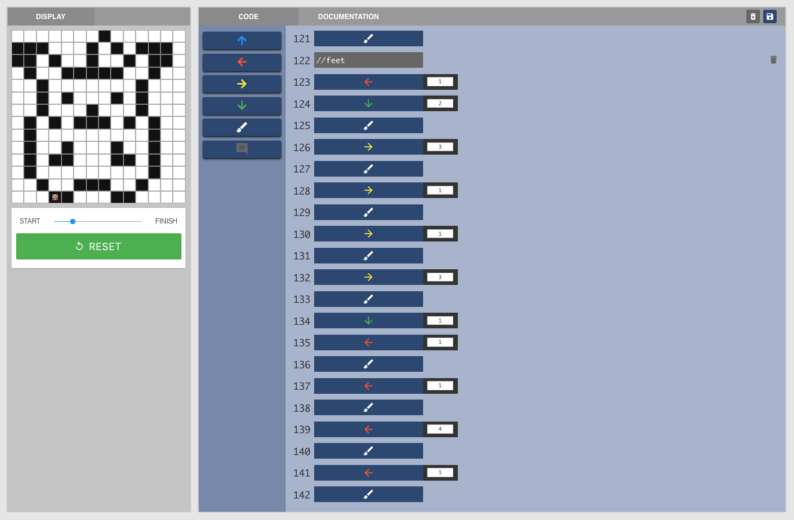
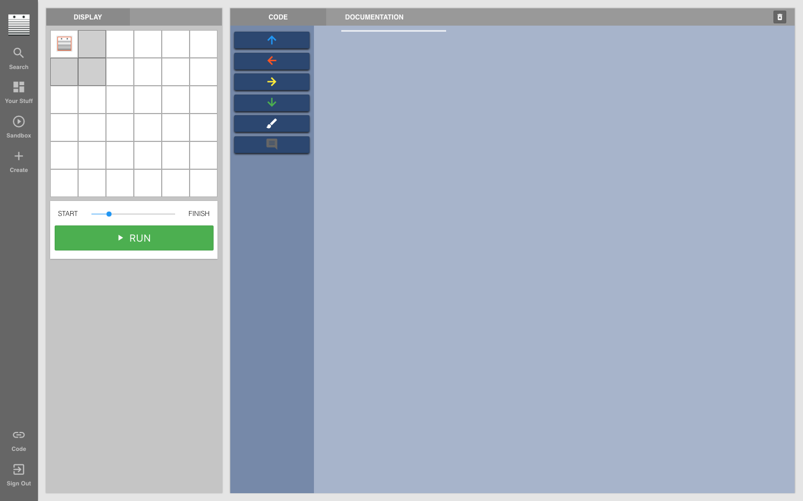

<header class='header' title='Pixel Artists' subtitle='Lesson 08'/>

<notable>
<iconp src='/icons/activity.png'>### Overview</iconp>
In lesson 8 students begin writing increasingly complex sequences. Students apply the plan, code, validate protocol to complete a series of challenges with mixed commands.

<iconp src='/icons/objectives.png'>### Objectives</iconp>

I can write a 2-10 block sequence with more than one directional move.

<iconp src='/icons/agenda.png'>### Agenda</iconp>

1. Engage: Pixel Art (2 min)
1. Explore: Coding with Multiple Directional Moves (6 min)
1. Explain:  How to Code with Multiple Directional Moves (7 min)
1. Elaborate: Independent Coding (10 min)
1. Evaluate: Exit Ticket & Debrief (5 min)

<note>
<iconp src='/icons/materials.png'>### Materials</iconp>
###### Teacher Materials:
- [ ] Computer
- [ ] Projector
- [ ] [Pokemon Demo Code][code]
- [ ] [Pokemon Demo Video][video]
- [ ] [Slide Show][slides]

###### Student Materials:
- [ ] Computers
- [ ] [Lesson 8 Playlist][playlist]

<iconp src='/icons/vocab.png'>### Vocabulary</iconp>

- **Sequence** - A set of actions that must be performed in the order they are written.

</note>

<pagebreak/>

## Room Design

<note borderLeft='2px solid green' mt='2em'>
###### Symbols Key

<iconp ml='1.65em' type='question'>question</iconp>
<iconp ml='1.65em' type='answer'>answer</iconp>
- [ ] action item
</note>

<pagebreak/>

## 1. Engage: Pixel Artist (2 min)

- [ ] **Demonstrate** how to create pixel art on the Pixel Bot platform by playing the Pokemon Demo video in the slideshow.

- [ ] **Explain** that it’s possible to create black and white pixel art by simply using the commands we have already learned.

“We can create pixel art like this Pokemon by simply using commands that we have already learned to use.”

	<iconp type='question'>What commands do you see in the code that you have already used?</iconp>
	<iconp type='answer'>Up arrows (blue arrows), down arrows (green arrows), left arrows (red arrows), right arrows (yellow arrows), and the paintbrush.</iconp>

## 2. Explore: Coding with Multiple Directional Moves (5 min)

- [ ] **Introduce** students to the first pixel art challenge. (1 min)

- [ ] **Discuss** the commands that would be necessary to solve the pixel art challenge as a class. (1 min)

<iconp type='question'>Which commands do you think we need to use to complete this challenge?</iconp>

- [ ] **Independent Exploration:** Have students attempt to code the solution on their own. (3 min)
	- **Inform** students that this is their opportunity to come up with a solution on their own and you will not be answering any questions during the 3 minute period.
	- **Observe** the students’ computer screens in order to find solutions you may want to highlight during the next share out.

## 3. Explain: How to Code with Multiple Directional Moves (8 min)

- [ ] **Share Out:** Students share the approaches they took to complete the challenge. (1 min)
	- Ask the class if anyone would like to share their solution.
	- Have a volunteer plug his/her computer into the projector and run his/her code.

- [ ] **Model** a solution to the pixel art challenge (3 min)
	- Display the challenge on the board.

"I want to paint two squares. I can’t paint them both at the same time so I will have to choose one to color first."

<iconp type='question'>Does it matter which one I go to first?</iconp>
<iconp type='answer'>No. Both solutions are correct and there are many other solutions to this problem.
</iconp>

“I will color the bottom square first, then I will color the top square.”

- *Plan:* Using your finger, trace the path that you want the bot to travel and select a command.

"My bot will go down one space and paint the bottom square. Then I will have it go up two spaces and paint the top square. Since my bot needs to move down one step to start, I will begin by choosing a down arrow command."

- *Code:*  Select a down arrow command and continue coding until finished.
- *Validate:* Click run to check if the code works as expected.

"Now that I have my code, I need to check if it does what I want it to. I can click run to check."

- [ ] **Guided Practice:** The class solves the second pixel art challenge together. (4 min)
	- Show slide 4 and explain that there are many ways to complete the challenge.
	- Trace two paths on the board with your finger and have the class choose one of the two options in slide 4.

	<iconp type='question'>Here are two possible paths to complete this challenge. Which path should we take?</iconp>

- *Plan:* Have the class examine the path chosen and have them select a command to start.

<iconp type='question'>Which command should we give our bot if we want to follow this path?</iconp>

- *Code:* Select the command the class chooses and continue asking for the next command.
- *Validate:* Run the code to check if it does what the class expected.

<iconp type='question'>Did the code do what we expected it to do?
</iconp>

## 4. Elaborate: Independent Coding (10 min)
- [ ] **Independent Coding:** Have students work on the independent practice playlist and monitor the class for students in need of additional assistance. (7 min)
- [ ] **Review** 2-3 problems using the plan, code, validate protocol. (3 min)

## 5. Evaluate: Exit Ticket and Debrief (5 min)
- [ ] **Exit Ticket:** Students attempt to code a square to show mastery of the day’s objective. (3 min)
- [ ] **Debrief** the exit ticket challenge by discussing possible solutions.

</notable>

[slides]: https://docs.google.com/presentation/d/1qeIizOTAOSBPyBPTeQLBLGN9-gFB_DagHLUC7EVrgvw/edit#slide=id.p
[code]: https://www.pixelbots.io/JQLWZ
[video]: https://drive.google.com/file/d/0B48_2vIyABioMy10Rm1BX0FGS00/view
[playlist]: https://www.pixelbots.io/V1NO2
