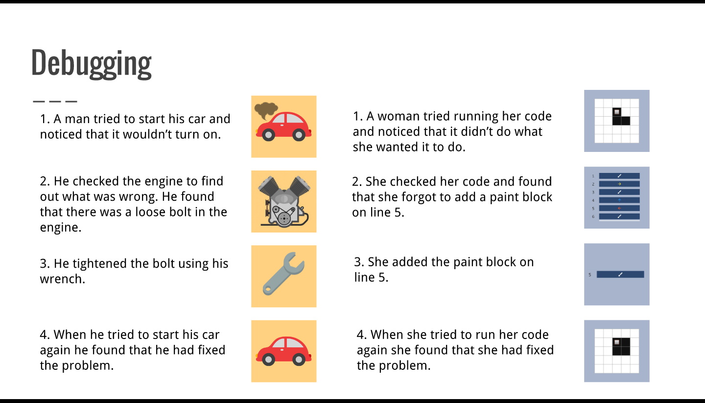
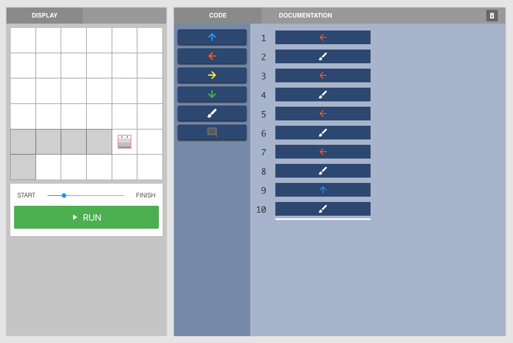

<header class='header' title='Bug Catchers' subtitle='Lesson 09'/>

<notable>
<iconp src='/icons/activity.png'>### Overview</iconp>
In lesson 9 students apply the debugging protocol to increasingly complex sequences similar to the ones seen in lessons 7 and 8.

<iconp src='/icons/objectives.png'>### Objectives</iconp>
I can debug a 2-10 block sequence with more than one directional move.

<iconp src='/icons/agenda.png'>### Agenda</iconp>

1. Engage: Debugging Analogy (3 min)
1. Explore: Bug Catching (6 min)
1. Explain: Debug the Bot (8 min)
1. Elaborate: Independent Coding (10 min)
1. Evaluate: Exit Ticket (3 min)

<note>
<iconp src='/icons/materials.png'>### Materials</iconp>
###### Teacher Materials:
- [ ] Computer
- [ ] Projector
- [ ] [Pixel Bot Token][token]
- [ ] [Slide Show][slides]

###### Student Materials:
- [ ] Computers
- [ ] [Lesson 9 Playlist][playlist]

<iconp src='/icons/vocab.png'>### Vocabulary</iconp>
- **Bug** - An error in code.
- **Debugging** - Finding and fixing errors in code.

</note>

<pagebreak/>

## Room Design

<note borderLeft='2px solid green' mt='2em'>
###### Symbols Key

<iconp ml='1.65em' type='question'>question</iconp>
<iconp ml='1.65em' type='answer'>answer</iconp>
- [ ] action item
</note>

<pagebreak/>

## 1. Engage: Debugging Analogies (3 min)
- [ ] **Analogy:** Introduce the broken car and debugging scenarios. (1 min)

“I’m going to share two quick stories with you. Your job is to try to find out how they are similar.”

- [ ] **Read** slide two to the class.

- [ ] **Discuss** how fixing a broken car is analogous to debugging code. (2 min)

<iconp type='question'>What did the man notice about his car? What did the woman notice about her code?</iconp>
<iconp type='question'>What did the man and woman do after noticing there was a problem?
</iconp>
<iconp type='question'>When the man and woman thought they knew what was wrong, they each tried to do something to fix the problem. How did they each test if their solution was correct?</iconp>
<iconp type='question'>How is fixing a car similar to debugging code?</iconp>

## 2. Explore: Bug Catchers (6 min)

- [ ] **Review** the debugging protocol with the class using problem number one in the Pixel Bot playlist. (4 min)

- *Compare* the code's objective to what it actually does.

“The code is supposed to make the bot move one space to the right and paint the square. The bot should then move down one space, move one space to the left, and paint the square.”

- [ ] Click run to show class what the code currently does.

<iconp type='question'>Does the code do what we want it to do?</iconp>
<iconp type='question'>What does it do incorrectly?</iconp>

- *Find* the bug(s).

“Let’s step through the code to find what went wrong. Raise your hand when you notice a mistake and be ready to share out what you think the mistake is.”

- Using the Pixel Bot token, step through the code one block at a time.
- Call on a student to share out the mistake he/she noticed.

- *Fix* the code.

<iconp type='question'>What should we change in the code?</iconp>

- Make the necessary changes and run the code.

<iconp type='question'>Did the changes fix the problem?
</iconp>

- [ ] **Independent Exploration:** Students attempt to find and repair the bugs in a program. (2 min)

- Have students attempt to use the debugging protocol to fix the second problem in the Pixel Bot playlist.

## 3. Explain: Debug the Bot (8 min)

-  [ ] **Share Out:** Students share the bug they found in the code and how they tried to fix it. (2 min)

-  [ ] **Model** using the debugging protocol to fix the code in the independent exploration activity. (2 min)

- *Compare* the code’s objective to what it actually does.

“The code is supposed to move the bot one space to the right and paint the square. The bot should then move down one space, left one space, and paint the square.”

- *Find* the bug(s).

- Step through the code and have students raise their hands when they notice the program do something unexpected.

- *Fix* the code.

<iconp type='question'>The code doesn’t direct our bot to color the first square it moves to. What should we change so that it paints the square?</iconp>
<iconp type='answer'>We should add a paint block after line 1.</iconp>

- Make the necessary change and run the code.

- [ ] **Code Along:** Perform a code along with the class using problem number 3 in the lesson 9 playlist. (4 min)

- *Compare* the code’s objective to what it actually does.

“The code is supposed to move the bot one space to the left and paint a square 3 times. Then it should move down one space and paint the final square.”

- Have students run the code.

<iconp type='question'>What does the code make the bot do?</iconp>

- *Find* the bug(s).

“The bot moves up instead of down.”

<iconp type='question'>Which line of code makes the bot move in the wrong direction?</iconp>

- *Fix* the code.

“The code directs the bot to move up instead of down at line 9. Let’s delete the up arrow block from that line.”

- Delete the incorrect block.

<iconp type='question'>What should we replace this line with?</iconp>

- Try out the ideas students share and have students do the same.
- Continue until the class comes up with a solution.

## 4. Elaborate: Independent Coding (8 min)

- [ ] **Independent Coding:** Have students practice using the debugging protocol on the lesson 9 playlist and monitor the class for students in need of additional assistance. (7 min)

- [ ] **Review** problem number 9 using the debugging protocol. (3 min)

1. *Compare* the code’s objective to what it actually does.
2. *Find* the bug(s).
3. *Fix* the code.

## 5. Evaluate: Exit Ticket (3 min)

- [ ] **Assess:** Have students complete the exit ticket problem in the playlist. (2 min)

- [ ] **Debrief:** Review the answer to the exit ticket problem. (1 min)
</notable>

[token]: https://drive.google.com/open?id=0B48_2vIyABiocXFmZ0pDdjczaUE
[slides]: https://docs.google.com/presentation/d/1eOMB0H9RWLkP3c9yzgT251OvLwqoauNgk93UhlAHr8c/edit
[playlist]: http://www.pixelbots.io/VP632
