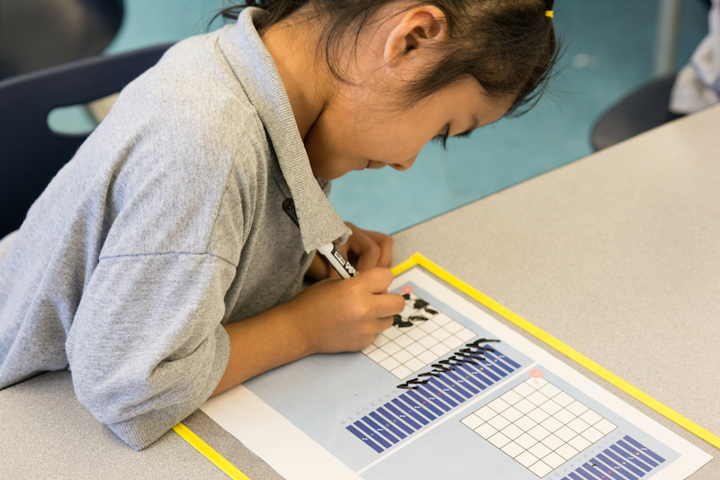

# preCoder Level 1

## Lessons

- [Lesson 1: Robot Mystery](../level-1/lesson-plans/lesson-1/lesson.md)
- [Lesson 2: turtleMove Part I](../level-1/lesson-plans/lesson-2/lesson.md)
- [Lesson 3: turtleMove Part II](../level-1/lesson-plans/lesson-3/lesson.md)
- [Lesson 4: Turtle Steps](../level-1/lesson-plans/lesson-4/lesson.md)
- [Lesson 5: pixelBot](../level-1/lesson-plans/lesson-5/lesson.md)
- [Lesson 6: Debugging](../level-1/lesson-plans/lesson-6/lesson.md)
- [Lesson 7: Directional Moves](../level-1/lesson-plans/lesson-7/lesson.md)
- [Lesson 8: Pixel Artists](../level-1/lesson-plans/lesson-8/lesson.md)
- [Lesson 9: Bug Catchers](../level-1/lesson-plans/lesson-9/lesson.md)
- [Lesson 10: Review](../level-1/lesson-plans/lesson-10/lesson.md)
- [Lesson 11: Summarizing I](../level-1/lesson-plans/lesson-11/lesson.md)
- [Lesson 12: Summarizing II](../level-1/lesson-plans/lesson-12/lesson.md)
- [Lesson 13: Decomposition I](../level-1/lesson-plans/lesson-13/lesson.md)
- [Lesson 14: Decomposition II](../level-1/lesson-plans/lesson-14/lesson.md)
- [Lesson 15: Identifying Patterns](../level-1/lesson-plans/lesson-15/lesson.md)
- [Lesson 16: Repeating Patterns](../level-1/lesson-plans/lesson-16/lesson.md)
- [Lesson 17: Patterns in Code](../level-1/lesson-plans/lesson-17/lesson.md)
- [Lesson 18: Writing Loops](../level-1/lesson-plans/lesson-18/lesson,md)
* [Lesson 19: Writing Loops](../level-1/lesson-plans/lesson-19/lesson.md)
