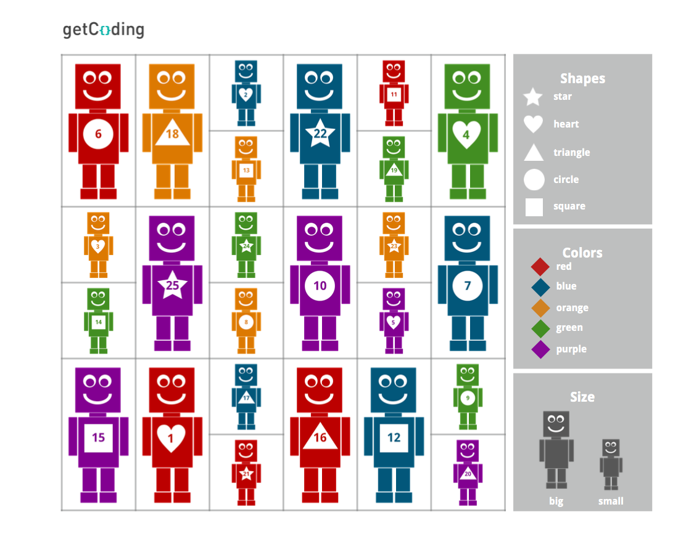

<header class='header' title='Mystery Robot' subtitle='Lesson 1'/>

<notable>
<iconp src='/icons/activity.png'>### Overview</iconp>
In lesson 1 students are introduced to the concept of productive failure. Students are engaged through a story about a little girl that learns from a series of failures to build a magnificent machine. Students then apply the lesson learned from the story to solve a mystery.

<iconp src='/icons/objectives.png'>### Objectives</iconp>

- I can identify what I learned from being wrong.

<iconp src='/icons/agenda.png'>### Agenda</iconp>

1. **Engage: The Most Magnificent Thing (7 min)**
	1. **Introduce** students to the concept of productive failure by reading *The Most Magnificent Thing*.
1. **Explore: Mystery Robot (10 min)** Students use a series of clues to determine the identity of a mystery robot.
1. **Explain/Elaborate: Mystery Robot Part II (10 min)** Students determine the identity of a mystery robot asking a series of questions.
1. **Evaluate: Debrief (3 min)**
	1. **Discuss:** Students make connections between the activities and productive failure by participating in a discussion.
<note>
<iconp src='/icons/materials.png'>### Materials</iconp>
###### Teacher Materials:
- [ ] Projector
- [ ] [Lesson 1 Slides][slide-show]
- [ ] [Robot Cards][robot-cards]
- [ ] *The Most Magnificent Thing*

###### Student Materials:
- [ ] [Robot Boards][robot-boards]
- [ ] Dry Erase Markers

</note>

<pagebreak/>

## Room Design

<note borderLeft='2px solid green' mt='2em'>
###### Symbols Key

<iconp ml='1.65em' type='question'>question</iconp>
<iconp ml='1.65em' type='answer'>answer</iconp>
- [ ] action item
</note>

<pagebreak/>
## Engage: The Most Magnificent Thing (7 min)
- [ ] Read *The Most Magnificent Thing* to the class. Pause and ask the questions below as you read.

<iconp type='question'>*Page 8:* What does the girl do after trying to build her invention the first time?</iconp>
<iconp type='answer'>The girl sees that the invention does not work and tries again.</iconp>

<iconp type='question'>*Page 22:* Why does the girl give up?</iconp>
<iconp type='answer'>The girl gives up because she can’t build her invention the right way.</iconp>  

<iconp type='question'>*Page 26:* What did the girl notice about each one of her inventions?</iconp>
<iconp type='answer'>The girl notices that there are parts of each invention that are actually good.</iconp>  

<iconp type='question'>*Page 29:* What did the girl learn about getting things wrong?</iconp>
<iconp type='answer'>The girl learned that you can still learn something from being wrong.</iconp>  

<pagebreak/>

## Explore: Mystery Robot (10 min)

<note type='key' title='Key Points'>
- Clues help us solve problems by eliminating possibilities.
- Some clues help us eliminate more possibilities than others.
</note>

**Goal:** Students must determine the identity of the mystery robot by using the clues provided by the teacher.
- [ ] Pass out a robot board and a dry erase marker to each student.
- [ ] Select a robot from the deck of cards and share a clue.
- [ ] Model how to eliminate robots that do not fit the clue by crossing them out on slide 2.
- [ ] Have students eliminate robots on their robot boards with a dry erase marker.
- [ ] Continue sharing clues and having students eliminate robots until only one robot is left.

## Explain/Elaborate: Mystery Robot II (10 min)

<note type='key' title='Key Points'>
- Each question helps us learn something.
- Some questions help us eliminate more possibilities than others.
- Some of our guesses about the robot’s attributes may be wrong, but we can still learn something from being wrong.
</note>

**Goal:** Students must determine the identity of a mystery robot by asking questions about its attributes.
- [ ] Select a robot from the deck of cards.
- [ ] Have students ask questions about the robot’s color, shape, size, and number.
- [ ] Have students eliminate robots that do not fit the information gained.
- [ ] Continue answering students questions until the class identifies the mystery robot.

## Evaluate: Discussion (3 min)

<note type='key' title='Key Points'>
- Each guess made and question asked got the group closer to figuring out the mystery robot.
- It is ok not to get something right the first time.
- We can learn just as much from being wrong as we can from being right.
</note>

Debrief the activity with a discussion.

 

###### Discussion Questions
<iconp type='question'>How did it feel when you made a guess that was wrong?</iconp>
<iconp type='question'>Did we learn anything when we were wrong?</iconp>
<iconp type='question'>How was playing this game similar to the girl building her invention in *The Most Magnificent Thing*?</iconp>
<iconp type='question'>What did you learn about being wrong from playing this game?</iconp>

</notable>

[slide-show]: https://drive.google.com/open?id=1bIGou3ARKNB78DqcmsXUgywcwctqkx-pHWLKNK5IzpU
[robot-boards]: https://drive.google.com/open?id=0B48_2vIyABioa0Z0WXFfbFllaGc
[robot-cards]: https://drive.google.com/open?id=0B48_2vIyABioRWN5b2ZtM0JWcE0
