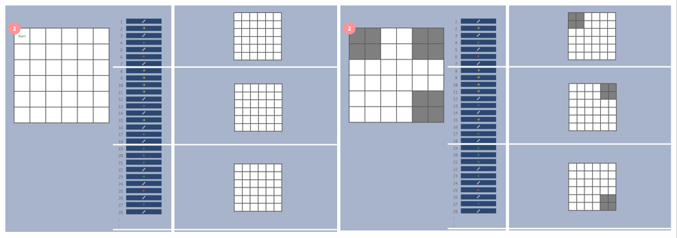

<header class='header' title='Summarizing II' subtitle='Lesson 12'/>

<notable>
<iconp src='/icons/activity.png'>### Overview</iconp>
Lesson 12 builds on lesson 11’s introduction to summarizing. Students learn that in addition to summarizing a sequence of code as a whole, smaller chunks of code within that sequence can also be summarized.

<iconp src='/icons/objectives.png'>### Objectives</iconp>
- I can summarize a chunk of code.

<iconp src='/icons/agenda.png'>### Agenda</iconp>

1. Engage: Story Time (5 min)
1. Explore: Step and Paint Summaries (3 min)
1. Explain: Chunk Summaries (8 min)
1. Elaborate: Chunking (10 min)
1. Evaluate: Exit Ticket (4 min)

<note>
<iconp src='/icons/materials.png'>### Materials</iconp>
###### Teacher Materials:
- [ ] Computer
- [ ] Projector
- [ ] [Slide Show][slides]

###### Student Materials:
- [ ] [Tokens][token]
- [ ] [Exploration Worksheet][explore]
- [ ] [Independent Practice Worksheet][practice]
- [ ] [Exit Ticket][ticket]

<iconp src='/icons/vocab.png'>### Vocabulary</iconp>
- **Summary** - A short statement that gives the most important information about something.

</note>

<pagebreak/>

## Room Design

<note borderLeft='2px solid green' mt='2em'>
###### Symbols Key

<iconp ml='1.65em' type='question'>question</iconp>
<iconp ml='1.65em' type='answer'>answer</iconp>
- [ ] action item

</note>

<pagebreak/>

## 1. Engage: Story Time (5 min)
- [ ] **Read** *The Lion and the Mouse* to the class and have students summarize each chunk of the story.

- [ ] Read the story by clicking the animations one line at a time until you arrive at the end of a chunk.
- [ ] Ask students to summarize each chunk.
	<iconp type='question'>What happened during lines _____ through _____ of the story?</iconp>

- [ ] Click the slide to show the picture that summarizes the chunk of the story.
- [ ] Repeat this process until students have summarized each chunk of the story.

-  [ ] **Explain** that chunks of code can be summarized just like parts of a story.

## 2. Explore: Step and Paint Summaries (3 min)
- [ ] **Independent Exploration:** Students step through code and draw images produced by chunks of code. (2 min)
- [ ] Direct students to step through a chunk of code and color the main grid left.

- [ ] **Share Out:** Students share out their summary of the code. (1 min)
	<iconp type='question'>What did the sequence direct the bot to paint?</iconp>
	<iconp type='answer'>The sequence made the bot paint a happy face.</iconp>

## 3. Explain: Chunk Summaries (8 min)
- [ ] **Model** how to step through and summarize chunks of code. (2 min)
- [ ] Project slide 3 on a whiteboard and step through lines 1-7 using the token. Color squares on the grid using a dry erase marker.
- [ ] On the grid to the right of the sequence, color only the squares that were colored according to the chunk containing lines 1-7.
- [ ] Continue this process until all three chunks are stepped through and colored.

- [ ] **Share Out:** Students summarize chunks of code. (1 min)
	<iconp type='question'>What do lines 1 through 7 do?</iconp>
	<iconp type='answer'>Lines 1 through 7 paint the happy face’s first eye.</iconp>

	<iconp type='question'>What do lines 8 through 14 do?</iconp>
	<iconp type='answer'>Lines 8 through 14 paint the happy face’s second eye.</iconp>

	<iconp type='question'>What do lines 15 through 27 do?</iconp>
	<iconp type='answer'>Lines 15 through 27 paint the happy face’s mouth.</iconp>

-  [ ] **Explain** why it is useful to be able to summarize chunks of code. (1 min)
	>> “Summarizing code is useful because it allows us to identify what each part of our code does.”

- [ ] **Guided Practice:** Students summarize chunks of code with teacher assistance. (4 min)
- [ ] Project slide 4 on a whiteboard.
- [ ] Have students step through lines 1-7 and color the main grid.
- [ ] Step through lines 1-7 on the board and have students compare their grid to yours.
- [ ] Have students color the corresponding grid on the right to reflect the image that was produced by lines 1-7. Repeat this process for the last two chunks of code.
			<iconp type='question'>What did lines 1 through 7 do?</iconp>
			<iconp type='answer'>Lines 1 through 7 painted a square.</iconp>

- [ ] Repeat this process for the last two chunks.

## 4. Elaborate: Chunking (10 min)
- [ ] **Independent Practice:** Have students complete the independent practice worksheet. (8 min)
- [ ] **Review** problems 1 and 2 from the worksheet with the class. (2 min)

## 5. Evaluate: Exit Ticket (4 min)
- [ ] **Assess:** Students complete an exit ticket to show mastery of the day’s objective.

</notable>

[slides]: https://docs.google.com/presentation/d/1pkFN9tsmUkZ1pIPAlyNtKQRCqDSHKW_w3tCYqV89my0/edit#slide=id.g1c179522f9_0_53
[token]: https://drive.google.com/open?id=0B48_2vIyABioeHdfMGQ0NzgxdXc
[explore]: https://drive.google.com/open?id=0B48_2vIyABioRGFkaDB0bDBPbWM
[practice]: https://drive.google.com/open?id=0B48_2vIyABioX1pkVFVYSV8wNUk
[ticket]: https://drive.google.com/open?id=0B48_2vIyABioWkZObG1qQVF6a2s
