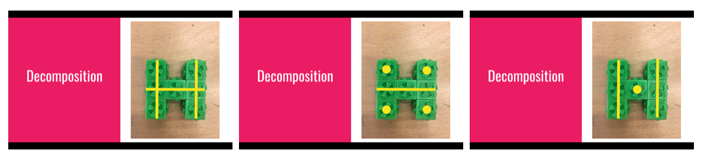

<header class='header' title='Decomposition I' subtitle='Lesson 13'/>

<notable>
<iconp src='/icons/activity.png'>### Overview</iconp>
Lesson 13 is an introduction to the concept of decomposition. The lesson begins with a focus on students forming their own understanding of what it means to decompose an object. Students then gain experience decomposing tangible objects and documenting the results.

<iconp src='/icons/objectives.png'>### Objectives</iconp>
- I can decompose an object.

<iconp src='/icons/agenda.png'>### Agenda</iconp>

1. Engage: Intro to Decomposition (8 min)
1. Explore: Decomposing T's (2 min)
1. Explain: Decomposing Letters (8 min)
1. Elaborate: Independent Practice (12 min)

<note>
<iconp src='/icons/materials.png'>### Materials</iconp>
###### Teacher Materials:
- [ ] Computer
- [ ] Projector
- [ ] [Slide Show][slides]

###### Student Materials:
- [ ] Computers
- [ ] 6 Omnifix Cubes/Student
- [ ] 1 Dry Erase Marker/Student
- [ ] [Decomposition Worksheet][worksheet]
- [ ] [Decomposing Playlist I][playlist]

<iconp src='/icons/vocab.png'>### Vocabulary</iconp>
- **Decompose** - To break something apart into smaller pieces.

</note>

<pagebreak/>

## Room Design

<note borderLeft='2px solid green' mt='2em'>
###### Symbols Key

<iconp ml='1.65em' type='question'>question</iconp>
<iconp ml='1.65em' type='answer'>answer</iconp>
- [ ] action item
</note>

<pagebreak/>

## 1. Engage: Intro to Decomposition (8 min)
- [ ] **Introduce** the word decompose and have students practice pronouncing it. Slides 2-8
>> “Today we are going to learn a new word that is really important in coding. The word is decompose. Repeat after me, de-com-pose”

- [ ] **Present** examples of decomposition. Slides 9-11
>> “Each of the following pictures is an example of something being decomposed. See if you can find what they all have in common.”

- [ ] **Discuss** the commonalities among the examples. Slide 12
<iconp type='question'>What do all of the examples have in common?
</iconp>

- [ ] **Explain** how the examples are related to decomposition.
>> “Each of the examples you saw shows something being taken apart.”

- [ ] **Define** decomposition.
>> “Decomposition is the process of breaking something apart into smaller pieces. When we break an object apart into smaller pieces we say we decomposed the object. It is possible to decompose things like objects, pictures, and even ideas. In order to help us remember what decomposition means, we are going to use a hand signal.”

- [ ] **Demonstrate** the decomposition hand signal while saying the word decompose.
- [ ] **Practice:** Have students practice using the hand signal and while saying the word.

## 2. Explore: Decomposing T's (2 min)
- [ ] **Demonstrate** how the omnifix cubes stick together and build the letter T.
- [ ] **Build:** Have students build the letter T using the omnifix cubes.
- [ ] **Decompose:** Have students decompose the letter T into two pieces.
- [ ] **Discuss** the approaches taken to decompose the letter T.
<iconp type='question'>How did you decompose the letter T?
</iconp>

## 3. Explain: Decomposing Letters (8 min)
-  [ ] **Explain** that there are many different ways to decompose an object. Slide 13
>>“You may have decomposed the letter T into two or more pieces and that is ok.  There are many ways to decompose an object, some are more useful than others depending on what you are trying to do. When we decompose an object in this activity we are going to try to decompose it into lines and dots. A line is two or more blocks joined together and a dot is one block by itself.”

- [ ] **Model** how to decompose the letter T into lines and dots. Slides 14-15
>> “When I look to decompose an object like this I want to look for as many lines as possible before looking for dots. First I look for long lines. Then I look for short lines. If I can’t find any more lines, I look for dots. I want to have more lines than dots.”

- [ ] **Model** using the worksheet to document the pieces produced from the decomposition of the letter T. Slides 16-17
>> “In order to show all of the pieces that make up the letter T, I put each piece on a separate grid in the same position it would be found in the letter. Then I color in the squares that are covered.”

-  [ ] **Demonstrate** how to form the letter H with the omnifix cubes and have students copy.

-  [ ] **Decompose:** Have students looks for long lines.
>> “We want to find as many long lines as possible.”

<iconp type='question'>How many long lines do we see?</iconp>

- [ ] **Explain** that there are three lines that are three blocks long, but they all can’t be produced together. Slides 18-23
>> “There are three long lines found in the letter H, but we can’t use them all. If I use the middle line it also makes four dots. If I use the two long lines on the end it also makes one dot. Since we want to make more lines than dots, we will use the two lines and one dot.”

- [ ] **Demonstrate** how to decompose the letter H and document the results on the worksheet. Have students copy the process.

- [ ] **Review** the process used to decompose the letters.
	1. Look for long lines.
	1. Break the letter apart to make more lines than dots.

## 4. Elaborate: Independent Practice (12 min)
- [ ] **Challenge** the class to try to decompose the letters C and Y on their own.
- [ ] **Review** how to decompose the letters C and Y.
- [ ] **Independent Coding:** Students code independently using the [Decomposing Playlist I][playlist].
- [ ] **Monitor** the room for students in need of additional assistance.

</notable>

[slides]:https://docs.google.com/presentation/d/13cMOHH1hZ03j9zT6KaRgBOnhhWSbg3umMvJTc6DkoQQ/edit#slide=id.g1c92ee6433_0_44
[worksheet]: https://drive.google.com/file/d/0B48_2vIyABioNFplUUh2cERKanM/view
[playlist]:http://www.pixelbots.io/J4376
