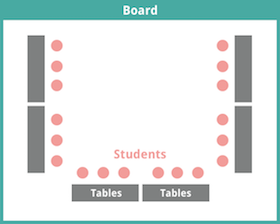

<header class='header' title='Lesson 14' subtitle='Decomposition II'/>

<notable>
<iconp src='/icons/activity.png'>### Overview</iconp>
In lesson 13 students learned how to decompose grid images into their simpler elements, lines and dots. Lesson 14 builds on this skill by teaching students its usefulness in coding increasingly complex images. Students use their decompositions from lesson 13 to code images of the letters they originally composed.

<iconp src='/icons/objectives.png'>### Objectives</iconp>
- I can code a decomposed image.

<iconp src='/icons/agenda.png'>### Agenda</iconp>

1. **Engage: Decomposition Review (5 min)**
1. **Explain: Decompose to Code (10 min)**
1. **Elaborate: Independent Practice (15 min)**

<note>
<iconp src='/icons/materials.png'>### Materials</iconp>
###### Teacher Materials:
- [ ] Computer
- [ ] Projector
- [ ] [Lesson 14 Slides][slides]

###### Student Materials:
- [ ] Computers
- [ ] [Decomposed Letters Sheet][sheets]

<iconp src='/icons/vocab.png'>### Vocabulary</iconp>
- **Decompose** - To break something apart into smaller pieces.

</note>

<pagebreak/>

## Room Design

<note borderLeft='2px solid green' mt='2em'>
###### Symbols Key

<iconp ml='1.65em' type='question'>question</iconp>
<iconp ml='1.65em' type='answer'>answer</iconp>
- [ ] action item
</note>

<pagebreak/>

## Engage: Decomposition Review (5 min)
**Setting:** Rug  

**Materials:** None  

- [ ] **Review** how to pronounce the word decompose. Slides 2-7
>> “Today we are going to continue learning about decomposition. Everyone say decompose. Repeat after me, de-com-pose. Now let’s put that all together. Repeat after me, decompose.”

- [ ] **Review** the decomposition hand gesture.
>> “In our last lesson we learned a hand gesture to help us remember what the word decompose means.”

<iconp type='question'>Can someone show me what the hand gesture for the word decompose looks like?
</iconp>
>> “Let’s all do it together. Do it with me as we say decompose”

- [ ] **Show** examples of decomposition. Slides 8-10
>> “Let’s look at some examples of decomposition. Think about how they are all related.”

- [ ] **Review** the definition of the word decompose.
<iconp type='question'>Can someone remind us what the word decompose means?</iconp>
>> “Decompose means to break something apart into smaller pieces. Each of the images we just saw shows something being broken into smaller pieces.”

## Explain: Decompose to Code (10 min)

## Elaborate: Independent Practice (15 min)

</notable>

[slides]: https://docs.google.com/presentation/d/10L6IRJjHOPYSiIRTujcMV1cagxx6txOwYXWI66qK3_4/edit#slide=id.p
[sheets]:
