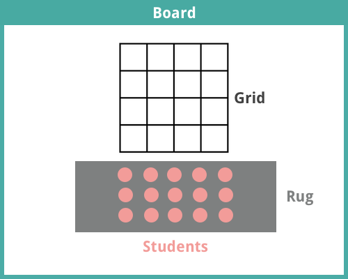
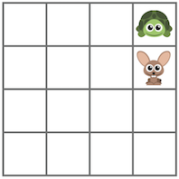
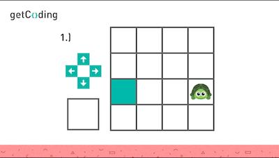
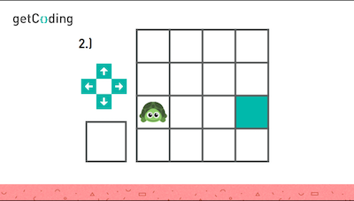

<header class='header' title='turtleMove Part II' subtitle='Lesson 3'/>

<notable>
<iconp src='/icons/activity.png'>### Overview</iconp>
In lesson 3 students continue to develop an understanding of how to use commands to control the actions of a computer. Students are introduced to the idea that simple commands can be used multiple times to complete a task.

<iconp src='/icons/objectives.png'>### Objectives</iconp>

- I can use multiple commands to control my turtle’s movements.

<iconp src='/icons/agenda.png'>### Agenda</iconp>

1. Engage: Warm Up (3 min)
1. Explore: Turtle Chase Video Game (10 min)
1. Explain: Multiple Commands (7 min)
1. Elaborate: Independent Practice & Review (7 min)
1. Evaluate: Exit Ticket (3 min)

<note>
<iconp src='/icons/materials.png'>### Materials</iconp>
###### Teacher Materials:
- [ ] Computer
- [ ] Projector
- [ ] [Lesson 3 Slides][slides]
- [ ] Floor Grid
- [ ] [Paper Star][paper-star]

###### Student Materials:

- [ ] [Paper Game Controller][game-controllers]
- [ ] [Practice Worksheet][ind-practice]
- [ ] [Exit Ticket][exit-ticket]

<iconp src='/icons/vocab.png'>### Vocabulary</iconp>

- **Code:** A set of instructions designed to be carried out by a computer.

</note>

<pagebreak/>

## Room Design

<note borderLeft='2px solid green' mt='2em'>
###### Symbols Key

<iconp ml='1.65em' type='question'>question</iconp>
<iconp ml='1.65em' type='answer'>answer</iconp>
- [ ] action item
</note>

<pagebreak/>

## 1. Engage: Warm Up (3 min)

- [ ] Pass out a set of paper game controllers.
- [ ] Place a star on the floor grid and stand in an adjacent square. Ask the class to hold the button they would press to navigate you to the star on the grid.

- [ ] Repeat step 2 three more times to ensure that students have practiced using all four directional commands.
- [ ] Place the star in a square at one end of the floor grid and stand in a square on the opposite end of the grid as shown in the picture below.

- [ ] Have the class press the button they would use to get you closer to the star.
- [ ] Have a volunteer share out their selection and ask the class to agree or disagree. Once the class has settled on a button choice act out their selection. Repeat this process until the class has successfully navigated you to the star.

<note type='key' title='Key Points'>
- It is possible to use more than one command to complete a task.
</note>

## 2. Explore: Turtle Chase Video Game (10 min)

###### How to Play
**Goal:** The turtle must try to catch the hare by moving into the same square as the hare.
- Starting with Team Hare, each team takes turns navigating their team member by pressing buttons on their game controllers.
- Teams select directions by having individuals volunteer to share our their button choice.

- [ ] Divide the class into two teams, Team Hare and Team Turtle.
- [ ] Select a volunteer from each group to play the role of the turtle and hare for their respective teams.
- [ ] Have the volunteer from Team Turtle stand in a corner of the grid and have the volunteer from Team Hare stand in an adjacent square.

- [ ] Explain the goal and rules of the game.
- [ ] Have students play the game.

## 3. Explain: Multiple Commands (7 min.)

- [ ] Project the slide of problem 1 on the independent practice worksheet.

- [ ] Model how to solve the problem.
   1. Circle the button you should press to get the turtle to the colored square.
   1. Count the number times you should press the button by counting the number of squares the turtle would have to step through to stand in the colored square.
   1. Write the number of times you should press the button in the blank square.

<note type='key' title='Key Points'>
- It is possible to complete a task by choosing multiple commands.
- We will practice selecting multiple commands in this activity.
</note>

- [ ] Complete problem two with the help of the class.

## 4. Elaborate: Independent Practice (7 min)

- [ ] Have students complete the independent practice worksheet. Monitor the class for students in need of assistance.
- [ ] Review 2-3 problems from the worksheet with the group by having student volunteers share out their answers.

## 5. Exit Ticket (3 min)

- [ ] Have students complete the exit ticket to check for understanding.

</notable>

[slides]: https://drive.google.com/open?id=1sEgDN-IjoNcAdUqGP7Vlm5bqLMkpUa1Agt_x6rCLoTU
[paper-star]: https://drive.google.com/open?id=0B48_2vIyABioelNBOFh0VHhWaEE
[game-controllers]: https://drive.google.com/open?id=0B48_2vIyABioRVJkODVORy1FNEk
[ind-practice]: https://drive.google.com/open?id=0B48_2vIyABioRlNJQjhjMlJSUU0
[exit-ticket]: https://drive.google.com/open?id=0B48_2vIyABioU0FPUVlXaXBQcU0
