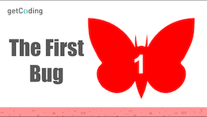
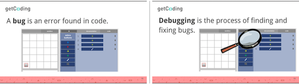
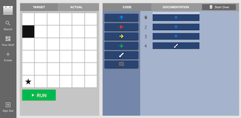
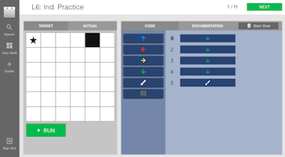
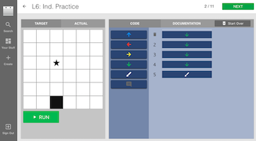

<header class='header' title='Lesson 6' subtitle='Debugging'/>

<notable>
<iconp src='/icons/activity.png'>### Overview</iconp>
In lesson 6 students are introduced to the concept of debugging. Through a series of debugging challenges, students unearth the debugging protocol and learn what it means to have a debugging mindset.

<iconp src='/icons/objectives.png'>### Objectives</iconp>

I can debug a 2-5 block sequence.

<iconp src='/icons/agenda.png'>### Agenda</iconp>

1. **Engage: What is a bug? (5 min)**
	1. **Read** The First Bug. (3 min)
	2. **Define** bug and debugging. (1 min)
	3. **Explain** the importance of debugging. (1 min)
1. **Explore: Unearth Debugging Protocol (6 min)**
	1. **Introduce** students to the first debugging challenge. (1 min)
	2. **Independent Exploration:** Students try to determine if the code is valid using their computers. (2 min)
	3. **Discuss** what the code did as a class. (1 min)
	4. **Turn and Talk:** Students discuss in pairs what they did to try to fix the code. (1 min)
	5. **Share Out:** Volunteers share what they discussed with their partner. (1 min)
1. **Explain: Debugging Protocol (8 min)**
	1. **Model** the debugging protocol. (3 min)
	2. **Code Along:** Perform a code along with the class. (5 min)
1. **Elaborate: Independent Practice (11 min)**
	1. **Independent Practice:** Students work on the independent practice debugging playlist. (8 min)
	2. **Review** 2-3 problems using the debugging protocol. (3 min)

<note>
<iconp src='/icons/materials.png'>### Materials</iconp>
###### Teacher Materials:
- [ ] Projector
- [ ] [Slideshow][slide-show]

###### Student Materials:
- [ ] Computers
- [ ] [Pixel Bot Playlist][playlist]

<iconp src='/icons/vocab.png'>### Vocabulary</iconp>

- **Bug** - An error in code.
- **Debugging** - Finding and fixing errors in code

</note>

<pagebreak/>

## Room Design

<note borderLeft='2px solid green' mt='2em'>
###### Symbols Key

<iconp ml='1.65em' type='question'>question</iconp>
<iconp ml='1.65em' type='answer'>answer</iconp>
- [ ] action item
</note>

<pagebreak/>

## Engage: What is a Bug? (5 min)

- [ ] **Read** the story of the first bug. (3 min)

<iconp type='question'>Why was it important for the computer scientists not to give up?</iconp>

- [ ] **Define** bug and debugging. (1 min)
	- A bug is an error found in code.
	- Debugging is the process of finding and fixing bugs.

- [ ] **Explain** the importance of debugging. (1 min)
	- Bugs are common.
	- Even the best coders make mistakes.
	- Becoming a good coder means becoming good at debugging.
	- The most important part of debugging is not giving up like the computer scientists in the story.

## Explore: Unearth Debugging Protocol (6 min)

- [ ] **Introduce** students to the [first debugging challenge][challenge]. (1 min)
	- The code is supposed to make the zebra move up 4 spaces and paint a square.

- [ ] **Independent Exploration:** Have students try to determine if the code is valid using their computers. If the code is not valid students should try to fix it. (2 min)
- [ ] **Review** the code's objective.
- [ ] **Discuss** what the code did as a class. (1 min)

<iconp type='question'>What did the code do?</iconp>
<iconp type='question'>What did you do to figure it out?</iconp>

- [ ] **Turn and Talk:** Have students discuss in pairs how they attempted to fix the code. (1 min)

- [ ] **Share Out:** Have volunteers share what they discuss with their partner. (1 min)

## Explain: Debugging Protocol (8 min)
- [ ] **Model:** Using the same problem from the Explore activity, model the debugging protocol. (3 min)
	1. *Compare* the code’s objective to what it actually does.
> > “The code is supposed to make the zebra go up 4 spaces and paint the square. Right now it goes up 3 spaces and paints a square. It doesn’t go far enough.”
	1. *Find* the bug(s).
> > “The code needs 4 up arrow blocks. It only has 3.”
	1. *Fix* the code.
> > “I will add another up arrow block before the paint brush block. This will make the zebra move 4 spaces and then paint the block just like we wanted it to.”

- [ ] **Code Along:** Using the first problem in the debugging playlist, perform a code along with the class. (5 min)

- *Compare* the code's objective to what it actually does and have students run the code.

<iconp type='question'>What does the code make the zebra do?</iconp>

- *Find* the bug(s). 

<iconp type='question'>Which line of code starts to move the zebra in the wrong direction?</iconp>

- *Fix* the code.

<iconp type='question'>What should we replace these lines with?</iconp>

<note>

</note>

- [ ] **Code Along II** (If time allows)
	- Follow the same debugging protocol used in the previous code along to debug the second problem in the debugging playlist.

## Elaborate: Pixel Bot Practice (11 min)
- [ ] **Independent Practice:** Have students work on the independent practice [debugging playlist][playlist] and monitor the class for students in need of additional assistance. (8 min)
- [ ] **Review** 2-3 problems using the debugging protocol. (3 min)
	1. **Compare** the code’s objective to what it actually does.
	2. **Find** the bug(s).
	3. **Fix** the code.

</notable>

[slide-show]: https://docs.google.com/presentation/d/1wrmh9mI0GCt2xP7HzF8BW4FHuOdEOKr-L3STjKc-WC8/edit
[playlist]: http://artbot-26016.firebaseapp.com/XG3Y5
[challenge]: https://artbot-26016.firebaseapp.com/JO527
