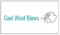
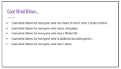
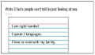
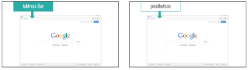
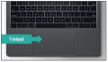
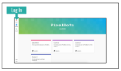
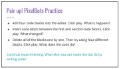
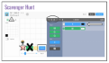
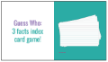

<header title='PixelBots Emoji' subtitle='Lesson 01: Digital Literacy'/>

<notable>

<iconp src='/icons/activity.png'>### Overview</iconp>
Students get familiar with navigating and using their computer, as well as the PixelBots interface. During this lesson, set expectations for using the computers.

<iconp src='/icons/objectives.png'>### Objectives</iconp>
- I can log into and navigate my computer.
- I can navigate to a website.
- I can use a trackpad.
- I can navigate and use the PixelBots editor.

<iconp src='/icons/agenda.png'>### Agenda</iconp>

#### Length: 90 minutes

1. Team Building: Cool Wind Blows (5 minutes)
1. Logging Into Computers (15 minutes)
1. Navigating to PixelBots (5 minutes)
1. Trackpads (5 minutes)
1. PixelBots Interface (20 minutes)
1. PixelBots Scavenger Hunt (25 minutes)
1. Independent Practice & Card Game (15 minutes)

<note>

<iconp src='/icons/materials.png'>### Materials</iconp>

#### Teacher Materials
- [ ] Computer
- [ ] Projector
- [ ] PixelBots.io
- [ ] [Lesson 1 Slides][slides]

#### Student Materials
- [ ] Computer
- [ ] PixelBots Account
- [ ] [T&T Emoji | 1 Playlist (Code: 9X5YW)][playlist]
- [ ] [Scavenger Hunt Worksheet][worksheet]

<iconp src='/icons/vocab.png'>### Vocabulary</iconp>

</note>
<pagebreak/>

#### Team Building: Cool Wind Blows (5 minutes)
- [ ] **Engage** students in a team building game. Players sit or stand in a circle, with one person in the center as “the cool wind.” This person says a fact about themselves and all players who share the same fact must get up and find a new seat. For example, “Cool wind blows…  for someone who has an older brother. Anyone who has an older bother now has to stand up and move to a new seat.”
  >>“Welcome everyone! We are going to play a quick game to get to know each other better. Everyone it in a circle. During this game, we will start with a person in the middle. The person in the middle will say one fact that is true about themselves by saying “Cool Wind Blows” For example, Cool Wind Blows someone who wears glasses”. If this fact is true for you, you must leave your spot in the circle and move to an empty spot. You will want to do this quickly, before the person in the middle is able to take your spot. Whoever is left without a spot in the circle will be our next person in the middle. If you cannot think of any facts- look on the board for some suggestions!”
  - Suggestions:
    - Cool wind blows for everyone who has been to more than 2 states before.
    - Cool wind blows for everyone who hates chocolate.
    - Cool wind blows for everyone who loves Minecraft.
    - Cool wind blows for everyone who is addicted to video games.
    - Cool wind blows for everyone who loves tacos.

<note>**Slides:**
</note>
<pagebreak/>

- [ ] **Introduce** and explain to students the Guess Who Index Card Game. Students will write three facts about themselves on an index card. Throughout the course of PixelBots, read a card and have students guess who it is. Collect notecards. Read the first card at the end of today's lesson.
  >>“Great work! Now we are going to get to know each other even better by doing another activity. You will each get an index card. On the index card, write three facts about yourself that people may not know by just looking at you. For example, this could be 3 facts that I wrote about myself. (point to the slideshow) I am right handed, I speak 2 languages, and I love to cook with my family. When you are writing it, do not let your teammates see it. Please put your name on it. You will have 5 minutes. I will collect it after time is up, and we will do an activity with these later.”

<note>**Slides:**</note>

#### Logging Into Computers (15 minutes)
- [ ] **Introduce** students to their log-ins. It is helpful to print each login on paper and have students glue it somewhere they will not lose it (inside their workbooks).  
- [ ] **Discuss** the importance of not sharing passwords as a class.
  >>“When you create a username and password to log in to a computer or a program it is important not to share your password with anyone.”

  <iconp type='question'>Why do you think it is important to keep your password to yourself?</iconp>

- [ ] **Practice** logging in to the computers.

- [ ] **Monitor** the class for students in need of additional assistance.

**Reminder:** Common challenges encountered by students while logging in:
  - Finding letters, numbers and symbols on the keyboard
  - Typing errors
  - Using the shift key to type capital letters and other symbols
  - Caps lock on while typing a case sensitive username and/or password
  - Forgetting username and/or password

#### Navigating to PixelBots (5 minutes)
- [ ] **Explain** what a browser and address bar are used for.
  >>“Browsers are programs that allow us to view websites on the internet. Each website on the internet has an address. We can visit a website by typing its address in the address bar of the browser and pressing the enter key.”

<note>**Slides:**</note>
- [ ] **Model** navigating to a website by typing pixelbots.io in the address bar.

- [ ] **Practice:** Students navigate to pixelbots.io by typing the address in the address bar. Once they’re there, ask students to click on one of the courses (but don’t do anything beyond that).

- [ ] **Share Out:** Have volunteers respond to the questions below.
  <iconp type='question'>What do you notice happening in the address bar when you click on a course?</iconp>
  <iconp type='answer'>The address changes.</iconp>
  <iconp type='question'>Why do you think that happens?</iconp>
  <iconp type='answer'>Each page has its own address.</iconp>

#### Trackpads (5 minutes)
- [ ] **Share Out:** Have students respond to the question below.
  >>“The picture you see on the board shows an example of a trackpad.”

  <iconp type='question'>What have we been using a trackpad for today?</iconp>
<note></note>

- [ ] **Model** in the air how to hold your hand on the track pad by creating an “L” with your hand.

- [ ] **Practice:** Have students practice creating an “L” with their hands in the air.

- [ ] **Model** scrolling up and down using two fingers on the trackpad. Then show students the up and down finger movements using the image of the trackpad in the slide show.

<pagebreak/>
- [ ] **Practice:** Have students place their hands on the trackpad and use two fingers to scroll up and down the page they are on.

#### PixelBots Interface (20 minutes)
- [ ] **Guide** students in logging in to PixelBots. Explain that they can log in using their email address and password.
<note></note>

- [ ] **Model** how to navigate to the PixelBots Playlist by clicking on code, then typing in the playlist code and clicking go. Have students do the same.

- [ ] **Share Out:** Students respond to the question below.
  >>“This is the PixelBots editor screen.”

  <iconp type='question'>What are some things that you see on this screen?</iconp>
  <iconp type='answer'>Green arrow blocks, blue square block, speech bubble block, flashing white line, etc.</iconp>

- [ ] **Model** how to work with each of the key elements within the interface (clicking code blocks, inserting code blocks into existing code, deleting blocks, reset/play/step/check buttons, speed and transparency sliders)

- [ ] **Pair up:** Have students split into pairs and complete and discuss the following tasks in Challenge 1 of the playlist:
  >>"Right now we are going experiment and play with the PixelBots editor. I want you to add code blocks click play to see what happens, then add or delete code blocks click play and notice what changes. Try to use and learn every button."

  - Add four code blocks.
  - Insert an additional code block between their first and second code blocks.
  - Delete all of the blocks one by one. Then try using four different blocks.
  - Continue experimenting. See what else you can make your PixelBot do by writing code.

<note></note>
- [ ] **Circulate** through the class and check for students in need of additional assistance.
- [ ] **Share Out:** Students share out to the class what they’ve learned so far and to share any questions.

#### PixelBots Scavenger Hunt (25 minutes)
- [ ] **Introduce** the scavenger hunt activity. Provide each student with a scavenger hunt handout, and explain how to use the handout to complete the scavenger hunt.
  >>“Using what we’ve learned, let’s try this PixelBots scavenger hunt.”

<note>**Scavenger:**</note>
- [ ] **Model** how to navigate to the first challenge of a [T&T Emoji | 1 playlist (Code: 9X5YW)][playlist]. Have students do the same, and give them time to work on the scavenger hunt activity individually.

- [ ] **Circulate** through the class and check for students in need of additional assistance.
- [ ] **Debrief:** Ask students to share their scavenger hunt answers. Go over answers as a class.

#### Independent Practice & Card Game (15 minutes)
- [ ] **Independent Practice:** Students practice using PixelBots by working on subsequent challenges in their current playlist.

<pagebreak/>
- [ ] **Debrief** with Note Card Game: Pull a card and read the three facts. Read 1-3 cards depending on the size of the class anytime the class needs a break in any lesson moving forward.
  >>“Great job, coders! Today we learned how to code in pixelBots. Next time, we’ll learn about more of the different things you can do in pixelBots, and I’ll be revealing more details about the project that we’ll be using pixelBots to create. Before we leave today, let’s play the note card game. I will read the three facts. You will try to guess who in our class wrote these facts about themselves. If the notecard is yours, give people some time to solve it before revealing yourself.”

<note></note>

</notable>
[slides]: https://docs.google.com/presentation/d/19R_7549Cfos9MJmAleAMrTruzvGXshbN9TBA7iEUzZI/edit?usp=sharing
[worksheet]: https://docs.google.com/document/d/1jdyFTFEASeMM5yazZl-YTNktfYAR60AbI5iwLp5w30Y/edit
[playlist]: http://www.pixelbots.io/
[mathemoji]: http://wwww.pixelbots.io/
