<header title='PixelBots Emoji' subtitle='Lesson 02: Sequences'/>

<notable>

<iconp src='/icons/activity.png'>### Overview</iconp>
Students learn the fundamental coding concept of sequencing to program a bot to paint a given picture on PixelBots.io. Using forward, turnRight, turnLeft, and paint blocks, students will write sequential lines of code to move the bot and to paint. Students will be able to move the bot forward multiple steps by passing a number to the forward block and the bot can paint a square a specific color.

<iconp src='/icons/objectives.png'>### Objectives</iconp>
- I can write code in a sequence on PixelBots.
- I can navigate and use the PixelBots editor to write programs using icons.
- I can use specific numbers and colors with the forward and paint code blocks to paint an image in PixelBots.

<iconp src='/icons/agenda.png'>### Agenda</iconp>

#### Length: 90 minutes

1. **Engage:** What is Code? (15 minutes)
1. **Explore:** PixelBots (25 minutes)
1. **Explain:** Sequence (5 minutes)
1. **Elaborate:** PixelBots Challenges (30 minutes)
1. **Evaluate:** Exit Challenge (15 minutes)

<note>

<iconp src='/icons/materials.png'>### Materials</iconp>

#### Teacher Materials
- [ ] Computer
- [ ] Projector
- [ ] PixelBots.io
- [ ] [Lesson 2 Slides][slides]
- [ ] Example Emoji Project: [Math Eye Smiley (Code: B2G8N)][mathemoji]
- [ ] [T&T Emoji | 2 PixelBots playlist (Code: OWZ3R)][playlist]

#### Student Materials
- [ ] Computer
- [ ] PixelBots Account
- [ ] PixelBots Playlist: [T&T Emoji | 2 (Code: OWZ3R)][playlist]
- [ ] PixelBots Exit: [T&T Emoji | Exit 2 (Code: Y7922)][exit]

<iconp src='/icons/vocab.png'>### Vocabulary</iconp>
- **Code:** A set of instructions given to a computer to follow.
- **Sequence:** A set of actions that must be performed in the order they are written.

</note>
<pagebreak/>

#### 1. Engage: What is Code? (15 minutes)
- [ ] **Norms:** Set norms and high expectations for lesson.
  >>"Hi Coders! I'm very excited for our lesson today. To start off, let's read some class expectations. These expectations are to help us have an awesome class filled with learning and coding."

  <iconp type='question'>What are some more ways we can have a successful lesson?</iconp>
  <iconp type='answer'>Student answers will vary.</iconp>

<note>**Slides:**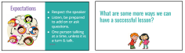</note>

- [ ] **Define:** Direct students to turn and talk with a partner about what the word code means to them. Then give the definition of code and present each of the examples on “Code is Everywhere” slide.

  <iconp type='question'>Turn to you neighbor and talk about what is code. </iconp>
  <iconp type='answer'>Popcorn students to share and write a few student responses on the board.</iconp>

  >>"What is code? Code is a set of instructions given to a computer to follow. Write this in your Coding Journal. Draw a picture that helps you remember this word. Code is everywhere!  Code is what creates the website or computer programs we use. Being a coder is about producing (or making),  not just consuming (or looking at/using)."

<note>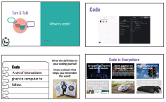</note>

- [ ] **Motivate:** Reveal the Emoji project over the projector. Show students the code and the bot painting the example emoji, [Emoji | Math Eye Smiley (Code: B2G8N)][mathemoji].
  >>"In this class you are going to design and create an Emoji with code! You will code a bot to paint your emoji on a platform called PixelBots. Here is an example of an emoji and the program. (Show emoji and run code on PixelBots.io) Before you can design and code our own emoji, you will first need to learn a few fundamental coding concepts. Today we will be learning about sequencing."

<note>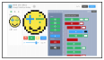</note>
<pagebreak/>
#### 2. Explore: PixelBots (25 minutes)
- [ ] **Code Along:** Students follow along on their own computer as you walk through each step of logging onto PixelBots.
  >>"Open your computers and follow along as we go to PixelBots.io and log in."
  - Steps:
    1. Open Chrome and type ‘www.pixelbots.io’ in the address bar.
    1. Click on ‘Log In’ and ‘Sign in with Google’
    1. Type in your email and click next.
    1. Type in your password and click next.
    1. Go to playlist: click ‘Code’, type playlist code: 'OWZ3R', then click ‘go’
    1. Click Play.

<note> **Slides:**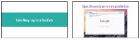
**Tip:** Uphold good classroom management on computers. When you give each step, students should have eyes on you and hands off computers.</note>

- [ ] **Turn & Talk:** Discuss Turn & Talk Norms with students. Then guide students to look at the first PixelBots challenge and practice turn & talk.
  >>"Turn & Talk is when you get to discuss your ideas with a partner. First, think about the following two questions. Partner A will share for 30 seconds and then Partner B will share for 30 seconds. Remember to be a good listener when your partner is sharing."

  <iconp type='question'>What do you suggest we do first? Why do you think this?</iconp>
  <iconp type='answer'>Partner A shares with Partner B.</iconp>
  <iconp type='answer'>Partner B shares with Partner A.</iconp>

<note> 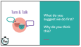</note>

- [ ] **Discuss:** Invite students to share out what they discussed in pairs. Guide the discussion by asking questions to push reasoning.
  >>"What did you discuss in your pairs for the first step? Why do you think this? Did anyone try something different?"

<pagebreak/>
- [ ] **Group Exploration:** Together as a class do Challenge 1, a write challenge, and Challenge 2, a debugging challenge, in the [T&T Emoji | 2 Playlist (code: OWZ3R)][playlist] over the projector. Students will follow along and provide how to code the bot to complete the challenge.  
  >> - **Challenge 1:** "Let’s code the first challenge together as a class. Our bot needs to paint this picture. (Show students how to toggle Layover). What blocks should we use to code the bot?"
  - **Challenge 2:** "Let’s do the second challenge together as a class. This challenge is a debugging challenge. Here code is written for you, but there are a few mistakes, we call these mistakes bugs. We are going to debug the code, which means to find the mistakes and fix them. What are the bugs in Challenge 2? And how do we fix them?"

<note>**Slides:** 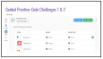</note>

- [ ] **Independent Exploration:** Give students 10 minutes to explore PixelBots. Circulate the class and check in with students.
  >>"Now that we have done a challenge together, I want you to try a few challenges on your own."

<note></note>

- [ ] **Discuss:** Lead a whole class discussion about the purpose of each tool in the PixelBots editor. Encourage students to agree/disagree, add on, etc.
  >> "Okay coders, now that you've explored PixelBots we will discuss the different parts of PixelBots."

  <iconp type='question'>What does this part in PixelBots do? (go through each numbered part)</iconp>
  <iconp type='answer'>Students predict the function of each numbered part of the editor.</iconp>
  <iconp type='answer'>1) The Layover shows what the bot needs to paint to complete the challenge.</iconp>
  <iconp type='answer'>2) Move forward code block</iconp>
  <iconp type='answer'>3) Turn Right code block</iconp>
  <iconp type='answer'>4) Turn Left code block</iconp>
  <iconp type='answer'>5) Reset button resets the bot</iconp>
  <iconp type='answer'>6) Stepper tool lets you run your program one line at a time.</iconp>
  <iconp type='answer'>7) Speed slider changes the speed of the code when it runs.</iconp>
  <iconp type='answer'>8) You can move forward a set number of times and you can paint a specific color.</iconp>
  <iconp type='question'>What instructions can we write to code the bot?</iconp>
  <iconp type='answer'>The bot can move forward, turn left, turn right, and paint. Students should learn that computers only understand certain instructions.</iconp>
  <iconp type='question'>Did you face any challenges? What were they? </iconp>
  <iconp type='answer'>As students share questions they had, clarify how to use the editor.</iconp>

<note>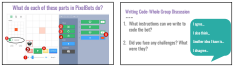</note>

#### 3. Explain: Sequence (5 minutes)
- [ ] **Discuss & Define** Sequence. Guide students through a discussion of how code is performed in order using Challenge 1 as an example. Then have students share activities in life where order matters. Give students the definition of sequence and have them write it in their coding journals.

  <iconp type='question'>Here is our code for Challenge 1 on the left. On the right we see lines 1 and 2 are switched. Would this program still create the same picture? Show your thinking, Does order matter?</iconp>
  <iconp type='answer'>Thumbs up. Order matters. If the lines of a program are switched the program would paint a different picture.</iconp>
  <iconp type='question'>Where else in life does order matter? </iconp>
  <iconp type='answer'>Students answers will vary. Ex. tying shoes, cooking, getting dressed, etc…</iconp>

  >>"In computer science, this is called sequencing. Sequence: A set of actions that must be performed in the order they are written. This means that the first block of code will be performed then the second block and so on. Write this definition in your coding journal."

<note>**Slides:**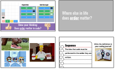</note>

#### 4. Elaborate: PixelBots Challenges (30 minutes)
- [ ] **Independent Practice:** Students work to complete challenges in [T&T Emoji | 2 Playlist (Code: OWZ3R)][playlist].
  - Playlist consists of two types of challenges:
    - Write - Students use code to move a bot to paint a given image.
    - Debug - Students are given code to fix to paint a given image.

  >>"We’ve learned about sequences and how to use code blocks and now we can code the bot to paint simple pictures. In these next challenges, we will continue to practice writing code and debugging code."

<note>**Slides:**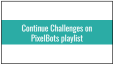
**Note:** Circulate around the class to clarify misunderstandings, push for student’s thinking, and reinforce the vocabulary word sequence. Ask students, "What sequence did you use for this challenge?" </note>

#### 5. Evaluate: Exit Challenge (15 minutes)
- [ ] **Call and Response:** Teach students the Challenge call and response. Teacher says: “I have a challenge for you.” Students respond with: “Bring it, bring it.”

<note></note>

- [ ] **Exit Challenge:** Students work independently to write a program to complete the Exit Challenge on [T&T Emoji | Exit 2 Playlist (Code: Y7922)][exit].
  >>"Okay coders, I have a challenge for you. (pause for students’ response). Use what we learned today to code this Exit Challenge! You will work on this challenge independently to show me and yourself what you learned this lesson."

<note>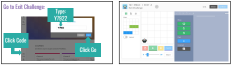</note>

- [ ] **Evaluate:** Circulate and check code to determine student’s understanding of sequences and writing code in PixelBots to paint a picture.

- [ ] **Review & Reflect:** Review new concepts and ask students to reflect in their coding journals according to prompts on slides.
  >>"Okay coders, now that you have achieved your challenge and we are at the end of our coding lesson, let’s review what we learned today."

  <iconp type='question'>What are the two new words we learned today?  Check your coding journals.</iconp>
  <iconp type='answer'>Code and sequence.</iconp>
  <iconp type='question'>What is code? </iconp>
  <iconp type='answer'>Code is a set of instructions for a computer to follow.</iconp>
  <iconp type='question'>What is does sequence mean?</iconp>
  <iconp type='answer'>Sequence means code blocks are performed in the order they are written.</iconp>

  >>"Now let’s reflect about today's lesson. Take a minute to draw an emoji OR write a hashtag! (pause for 1 minute). Now turn in pairs and share your responses to these questions. Good job today coders!"

<note>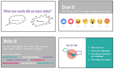
**Note:** If time allows, have a few students share out their reflection responses to the whole class.</note>

</notable>
[slides]: https://docs.google.com/presentation/d/1JNd7RDzdUGTFr9si7Q3b0Cs-4ccW4Kdc0xyVKprZEN4/edit?usp=sharing
[playlist]: http://www.pixelbots.io/OWZ3R
[exit]: http://www.pixelbots.io/Y7922
[mathemoji]: http://www.pixelbots.io/B2G8N
