<header title='PixelBots Emoji' subtitle='Lesson 03: Loops'/>

<notable>

<iconp src='/icons/activity.png'>### Overview</iconp>
Students are introduced to loops in block coding on PixelBots.io. Students will be able to use loops for repetitive sequences of code.

<iconp src='/icons/objectives.png'>### Objectives</iconp>
- I can rewrite a repeating sequence with a loop.

<iconp src='/icons/agenda.png'>### Agenda</iconp>

#### Length: 90 minutes

1. **Engage:** PixelBots Challenge (15 minutes)
1. **Explore:** Discovering Loops (10 minutes)
1. **Explain:** Loops in the Real World (10 minutes)
1. **Elaborate:** Coding Loops (40 minutes)
1. **Evaluate:** Exit Challenge (15 minutes)
<note>

<iconp src='/icons/materials.png'>### Materials</iconp>

#### Teacher Materials
- Computer
- Projector
- PixelBots.io
- [Lesson 3 Slides][slides]
- [T&T Emoji | 3 PixelBots playlist (Code: )][playlist]

#### Student Materials
- Computer
- PixelBots Account
- PixelBots Playlist: [T&T Emoji | 3 (Code: Q545K)][playlist]
- PixelBots Exit: [T&T Emoji | Exit 3 (Code: 8R9JX)][exit]

<iconp src='/icons/vocab.png'>### Vocabulary</iconp>
- **Loops:** A sequence of instructions that is repeated a set number of times.

</note>
<pagebreak/>

#### 1. Engage: PixelBots Challenge (15 minutes)
- [ ] **Norms:** Review norms for the lesson. Popcorn students to read the expectations from the slide.
  >>"Welcome back, Coders! We had a great lesson last time, and that's because we showed respect for one another. Let’s remind ourselves of our class expectations."

<note>**Slides:**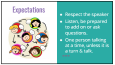</note>

- [ ] **Turn & Talk:** Students turn in pairs and review the previous lesson and their favorite part. Popcorn students to share and write a few student responses on the board. Reinforce the vocabulary words CODE and SEQUENCE.
  >>"In today’s lesson, we will use the tools and knowledge we learned last time. Turn and talk to your partners about what we learned last lesson."

  <iconp type='question'>What two words did we learn last lesson? </iconp>
  <iconp type='answer'>Code: A set of instructions given to computer to follow.</iconp>
  <iconp type='answer'>Sequence: A set of actions that must be performed in the order they are written.</iconp>
  <iconp type='question'>What was your favorite part of the last lesson?</iconp>
  <iconp type='answer'>Student answers will vary.</iconp>

<note>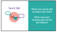</note>

- [ ] **Code Along:** Students follow along on their own computer as you walk through each step of logging onto PixelBots.
  >>“In today’s opening PixelBots challenge you are going to sequence code blocks to paint the image you see on the board. First let’s open our computers and follow these steps to get to the challenge:
  1. Open Chrome and type ‘www.pixelbots.io’ in the address bar.
  1. Click on ‘Log In’ and ‘Sign in with Google’
  1. Type in your email and click next.
  1. Type in your password and click next.
  1. Go to playlist: click ‘Code’, type playlist code: 'Q545K', then click ‘go.’
“After clicking go, put your hands on your head to show that you’re ready.”

<note>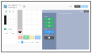
</note>

<pagebreak/>
- [ ] **Challenge** the class to complete the first PixelBots challenge in the [T&T Emoji | 3 playlist][playlist].
  >>“You will have 1 minute to code your solution for Challenge 1. When I say go, you can click play and get started... Ready, set, go!”

- [ ] **Share:** Have a volunteer share his/her solution verbally and code it as he/she shares. Run the code on PixelBots to check if it is valid.

- [ ] **Discuss** with the class about resolving Challenge 1 with less than eight lines of code. Student should come to the conclusion that this will not be possible, all eight coding blocks are needed.
  <iconp type='question'>Is it possible to solve Challenge 1 using less than 8 lines? Why or Why not?</iconp>
  <iconp type='answer'>No, all eight code blocks are needed.</iconp>

#### 2. Explore: Discovering Loops (10 minutes)
- [ ] **Challenge** the class to solve Challenge 2 on the playlist. This is the same coding challenge as Challenge 1, but should be solved using only 3 lines of code using the loop block. Make no reference to the loop block. Students should discover this on their own, and explore what it does. Circulate as students work on the challenge. If students need help, ask the student what new block he/she sees.
  >>“Let’s go to Challenge 2. This paints the same picture as Challenge 1, but instead you are able to solve this challenge using only 3 blocks of code. You have 3 minutes to paint this picture. Ready, set, go!”

<note>**Slides:** 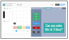</note>

- [ ] **Turn and Talk:** Give students one minute to discuss in pairs the approach they took to solve the challenge.
  <iconp type='question'>Were you able to find a solution?</iconp>
  <iconp type='question'>What did you try?</iconp>

<note>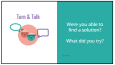</note>

- [ ] **Share out:** Popcorn students to share what they discussed during the Turn and Talk. Write the code that is shared in the PixelBot editor in order to validate it.

- [ ] **Contrasting Cases:** Contrast the code for Challenge 1 and Challenge 2 as a class.
  >>“The code for Challenge 1 and Challenge 2 are different, but we see that the same picture is painted and both programs work.”

  <iconp type='question'>How were we able to code Challenge 2 with less lines of code?</iconp>
  <iconp type='answer'>Using the new red code block.</iconp>
  <iconp type='question'>The new block you see is called a loop block. What code is inside of the loop block?</iconp>
  <iconp type='answer'>Forward and Paint</iconp>
  <iconp type='question'>How many times is the code inside of the loop block repeated? How do you know?</iconp>
  <iconp type='answer'>Repeats 4 times and we know because there is a number 4.</iconp>
  <iconp type='question'>How would you define a loop?</iconp>
  <iconp type='answer'>Call on multiple students to give their definitions. Then on the board, write class’ definition of loops.</iconp>

<note>**Slides:**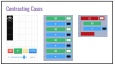</note>

#### 3. Explain: Loops in the Real World (10 minutes)
- [ ] **Define:** Give students the definition of loops and ask them to compare it to their definition.
  >>“Here is how computer scientists define loops: a sequence of instructions that is repeated a set number of times.”

  <iconp type='question'>How did we do? Does our definition match up to their definition?</iconp>
  <iconp type='answer'>Allow students to discuss this. They may need help understanding the words in the definition. They should be allowed to add to or modify their definition.</iconp>

  >>"Loops are powerful tools for coders! With loops we don’t have to write a sequence of code over and over to make it repeat."

<note>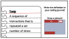</note>
<pagebreak/>
- [ ] **Making Connections:** Students see how loops apply to something they are familiar with: GIFs (an image format that repeats an animation).
  >>“Loops are everywhere! Some loops repeat over and over and over, they never stop. These are called forever loops. Let’s look at some GIFs and see how loops create the animation we see.”

  <iconp type='question'>What might the code look like for this GIF?</iconp>
  <iconp type='answer'>See code suggestions on slides. Students should nest the action they are seeing inside a loop block.</iconp>

<note>**Slides:** 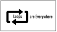
</note>

- [ ] **Turn & Talk:** Remind students of Turn & Talk norms. Then students discuss other examples of loops in real world.
  >>“Turn & Talk is when you get to discuss your ideas with a partner. First, think about the question. Partner A will share for 30 seconds and then Partner B will share for 30 seconds. Remember to be a good listener when your partner is sharing.”

  <iconp type='question'>What are other examples of loops in the real world?</iconp>
  <iconp type='answer'>Provide time for students to share.</iconp>

  >>“There are so many connections of loops in the real world. Now let's take a look at loops in PixelBots to see how they are very useful.”

<note>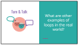</note>

#### 4. Elaborate: Coding Loops (40 minutes)
- [ ] **Model:** Students watch you do Challenge 3 on [T&T Emoji | 3 playlist (code: Q545K)][playlist] and demonstrate how to add a loop block around existing code. First select/highlight lines 2 and 3 by click on the line number, then click on the loop block.
  >>“Watch me first and then you can try. In Challenge 3, code is already written, but the challenge has a line limit of 4 lines. Let’s see if we can use a loop.
  1.  First we ask ourselves, what lines are repeating? Then we find out how many times it repeats.
  1.  Paint and forward are repeating and it repeats 5 times.
  1.  I can rewrite this code using a loop by clicking on line 2 and line 3. And then clicking on the loop block.
  1.  Paint and forward repeat 5 times so I can set the number of times the loop repeats to 5.
  1.  Since I rewrote the code using a loop I don’t need lines 6-13. I can delete them by click on 6 and 13 and then clicking the trashcan.
  Now I can run and check my code. It’s correct! Now you try.”

<note>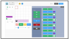</note>

- [ ] **Guided Practice:** Together as a class do Challenge 4. Students will follow along and provide how to code the bot to complete the challenge using the code blocks.
  >>“Let’s try Challenge 4 together as a class. How can we use a loop to use less lines of code? What lines are are repeating? How many times does it repeat?”

- [ ] **Independent Practice:** Students continue practicing writing loops independently by completing challenges on [T&T Emoji | 3 playlist (code: Q545K)][playlist].
  >>“Why are loops important or useful? Loops allow us coders to be efficient when we write code. Instead of us writing code that repeats over and over, we can have the computer repeat it using a loop. Now that we’ve learned about loops, let’s  continue practicing how to write and debug code with loops.

<note>**Slides:**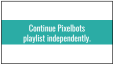</note>

#### 5. Evaluate: Exit Challenge (15 minutes)
- [ ] **Call and Response:** Remind students of the call and response. Teacher says: “I have a challenge for you.” Students say: “Bring it, bring it.”
<note>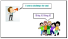</note>

<pagebreak/>
- [ ] **Exit Challenge:** Students work independently to write a program to complete the Exit Challenge on the [T&T Emoji | Exit 3 playlist (code:8R9JX)][exit].
  >>“Okay coders, I have a challenge for you. (*pause for students’ response*) Use loops to solve today’s Exit Challenge! You will work on this challenge independently to show me and yourself what you learned this lesson.”

<note>**Slides:** 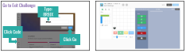</note>

- [ ] **Evaluate:** Circulate and check code to determine student’s understanding of loops in PixelBots to paint a picture.

- [ ] **Review & Reflect:** Review new concepts and ask students to reflect in their coding journals according to draw it and write it prompts on slides.
  >>“Okay coders, now that you have achieved your challenge and we are at the end of our coding lesson, let’s review some of the new concepts we learned today.

  <iconp type='question'>What did we learn today?</iconp>
  <iconp type='answer'>Loops</iconp>
  <iconp type='question'>How are they useful?</iconp>
  <iconp type='answer'>We can use loops to repeat sequences of code.</iconp>

  >>“Now let’s reflect using emojis and hashtags. Take 30 seconds to draw how you felt about today’s lesson using an emoji (pause for 30 seconds). Take 30 seconds to write how you feel today using a hashtag! (pause for 30 seconds). Now turn in pairs and share your responses. Good job today coders!”

<note>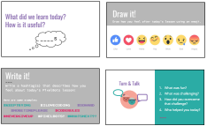
**Note:** If time allows, have a few students share out their reflection responses to the whole class.</note>

</notable>
[slides]:https://docs.google.com/presentation/d/1GGpO_PJ7YUYH800DMCofFcXWcaYSujHf141OIVW60L4/edit?usp=sharing
[playlist]: http://www.pixelbots.io/Q545K
[exit]: http://wwww.pixelbots.io/8R9JX
