<header title='PixelBots Emoji' subtitle='Lesson 04: Debugging'/>

<notable>

<iconp src='/icons/activity.png'>### Overview</iconp>
Students learn and apply the debugging protocol to a playlist of PixelBot Debugging Challenges. They will complete a series of longer debugging challenges to prepare them to tackle bugs in their emoji project.

<iconp src='/icons/objectives.png'>### Objectives</iconp>
- I can use the debugging protocol to debug my code.

<iconp src='/icons/agenda.png'>### Agenda</iconp>

#### Length: 90 minutes

1. **Engage:** Debugging History (15 minutes)
1. **Explore:** Challenge (15 minutes)
1. **Explain:** Debugging Protocol (10 minutes)
1. **Elaborate:** Debugging Challenges (35 minutes)
1. **Evaluate:** Exit Challenge (15 minutes)

<note>

<iconp src='/icons/materials.png'>### Materials</iconp>

#### Teacher Materials
- [ ] Computer
- [ ] Projector
- [ ] PixelBots.io
- [ ] [Lesson 4 Slides][slides]

#### Student Materials
- [ ] Computer
- [ ] PixelBots Account
- [ ] [T&T Emoji | 4 PixelBots playlist (code: 7OBD7)][playlist]
- [ ] [T&T Emoji | Exit 4 (code: 8K5K3)][exit]

<iconp src='/icons/vocab.png'>### Vocabulary</iconp>
- **Bug:** An error in code.
- **Debugging:** Finding and fixing errors in code.

</note>
<pagebreak/>

#### 1. Engage: Debugging History (15 minutes)
- [ ] **Turn & Talk:** Students turn in pairs and review vocabulary: code, sequence, and loop. Popcorn students to share and write a few student responses on the board.
  >>“Hello Coders! Let’s start off by reviewing what we’ve learned so far! Turn & Talk with your partner about the following questions.”

  <iconp type='question'>What is code? </iconp>
  <iconp type='answer'>Instructions for a computer to follow.</iconp>
  <iconp type='question'>What is a sequence? </iconp>
  <iconp type='answer'>A set of actions that must be performed in the order they are written.</iconp>
  <iconp type='question'>What is a loop? </iconp>
  <iconp type='answer'>A sequence of instructions that is repeated a set number of times.</iconp>

<note>**Slides:**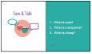</note>

- [ ] **Engage:** Show the video of Grace Hopper. Then guide a class discussion about Grace Hopper and the word debugging.
  >>“In today’s lesson, we are going to explore debugging. Before we do, let’s learn about Grace Hopper and where the word debugging comes from.”

  <iconp type='question'>Where did the word debugging come from? </iconp>
  <iconp type='answer'>It came from a literal bug found in the first computer. (Time in video 0:54)</iconp>
  <iconp type='question'>Who was Grace Hopper? </iconp>
  <iconp type='answer'>Grace Hopper was a female computer scientist and U.S. Navy admiral who discovered the first bug and had other significant contributions to Computer Science.</iconp>

<note>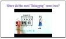</note>

- [ ] **Define** bug and debugging.
  >>“Things don’t always work the way we want them to when we code because we can often make mistakes. We call these mistakes in our code, bugs. Everyone say 'bug'. Write this down in your journal and draw a picture to help remind you of what it means.  Debugging is the process of removing bugs in our code. Everyone say 'debug'. Write this down in your journal and draw a picture to help remind you of what it means."

<note>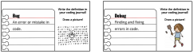</note>

#### 2. Explore: Challenge  (15 minutes)
- [ ] **Challenge** students to tackle a debugging challenge where the bot needs to paint a blue and yellow line. Guide students to go to [T&T Emoji | 4 playlist (code: 7OBD7)][playlist] and debug Challenge 1.
  >>"Today I have a series of bugs that I need help debugging. I challenge you to fix the bugs on your own before we talk about it together. The code in Challenge 1 is supposed to make the bot paint a blue and yellow line. Your job is to make sure it paints those two lines."

<note>**Slides:**
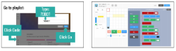</note>

- [ ] **Turn & Talk:** After students have a few minutes to try to debug the challenge, have them turn to their table partner and talk about the steps they took to complete the challenge. Then have them share out their strategies and write them on the board.
  >>"Turn to your table partner and talk about what steps you took to tackle this challenge. I am going to write your answers on the board in a few minutes."

  <iconp type='question'>What steps did you take to make sure the code did what it was supposed to do? </iconp>
  <iconp type='answer'>Student answers will vary. Write their ideas on the board.</iconp>

<note></note>

#### 3. Explain: Debugging Protocol (10 minutes)
- [ ] **Model** the debugging protocol and teach students the hand gestures for each step.
  >>“When we debug code we follow three basic steps: (1) Compare (2) Find (3) Try. Let's try it with Challenge 1. First Compare:"

<iconp type='question'>What did we want our program to do? What does it do instead?</iconp>
<iconp type='answer'>We wanted the bot to paint a blue line and a yellow line, instead the bot painted a blue and black line.</iconp>

<pagebreak/>
  >>“Step two, Find: We can use the yellow stepper tool to find where the bug might be."

<iconp type='question'>Where in the code do you think the bug is?</iconp>
<iconp type='answer'>Line 8</iconp>

  >>“Step three, Try: We will try to change the code to fix our bug."

  <iconp type='question'>What solution should we try? If the solution we try doesn’t work we choose another solution and try it out.</iconp>
  <iconp type='answer'>Let students try different solutions. Use the 'reset' button to reset the code.</iconp>

<note type="tip">Teach students the hand gestures for each step. Compare: hold your palms up as if you were weighing two options. Find: run your finger in front of you back and forth as if you're scanning a text. Try: pretend to turn a screwdriver in the air.
 
 
 

**Slides:**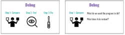
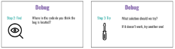</note>

 
- [ ] **Guided Practice:** The class works together to use the debugging protocol to solve a debugging Challenge 2. When students share have them respond to each other with "I agree because..." and "I disagree because..."
  >>“Let’s do Challenge 2 together as a class.”

  <iconp type='question'>Compare: What do we want our code to do? What does it do instead?</iconp>
  <iconp type='answer'>We want our code to paint an L of 4 squares tall. Instead it paints the L backwards and three squares tall.</iconp>
  <iconp type='question'>Find: Where in the code might the bug be located? I will give you a few minutes to step through the code and find what line you think has the bug.</iconp>
  <iconp type='answer'>Line 4 the loop and line 8</iconp>
  <iconp type='question'>Try: What is a possible solution?</iconp>
  <iconp type='answer'>Change loop to repeat 4 times, and change line 8 to turn left </iconp>

<note>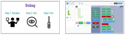</note>

#### 4. Elaborate: Debugging Challenges (35 minutes)
- [ ] **Independent Practice:** Students apply the debugging protocol to a series of challenges. During this time circulate to assist students in need of additional help.
  >>"Alright coders, now it’s your turn. Continue to use our 3 steps to debug the remaining challenges."

<note>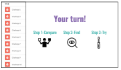</note>

<pagebreak/>
- [ ] **Share** solutions for a few debugging challenge from the playlist as a class. Have students project their solutions. Encourage the class to respond with "I agree because..." and "I disagree because..."

  <iconp type='question'>Compare: What do we want our code to do? What does it do instead?</iconp>
  <iconp type='question'>Find: Where in the code might the bug be located? I will give you a few minutes to step through the code and find what line you think has the bug.</iconp>
  <iconp type='question'>Try: What is a possible solution?</iconp>

<note>**Slides:** </note>

 
- [ ] **Review & Make Connections:** Review the three steps to the debugging protocol with the hand gestures. Have students turn and talk about debugging in their own life. Give students examples of people debugging in their own life: show code.org video, share JK Rowling’s story of trying to publish Harry Potter,  and  a time you debugged in your life. Then invite students to share out to the whole class.
  >>"As a coder you can follow those 3 steps anytime you find a bug. Bugs are a fact of being a coder. You probably run into bugs in your life all the time. Turn and Talk with your neighbor about a time when you have had to debug a situation in your everyday life."
  - “Here are a few examples of people debugging in their own life. Here is a video of a gymnast debugging her back handspring.
  - JK Rowling sent her manuscript to 12 different publishers and got rejected by every single one. Rowling began losing confidence in her book. One publishing editor decided to publish JK Rowling’s book because his daughter read the opening chapters and fell in love. Now Harry Potter been translated into 73 languages, sold millions of copies and accrued over $20 billion through movie adaptations and sponsorships. JK Rowling never gave up and kept persevering.”
  - We have time for a few more debugging stories, who would like to share? When have you had to debug a situation?”

<note>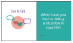
</note>

<pagebreak/>
#### 5. Evaluate: Exit Challenge (15 minutes)
- [ ] **Exit Challenge:** Students work independently to write a program to complete the Exit Challenge on [T&T Emoji | Exit 4 (Code:8K5K3)][exit].
  >>“Okay coders, I have a challenge for you. (*pause for students’ response*) Use the Debugging protocol to solve today’s Exit Challenge! You will work on this challenge independently to show me and yourself what you learned this lesson.”

<note>**Slides:** 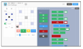</note>
 

- [ ] **Evaluate:** Circulate and check code to determine student’s understanding of debugging in PixelBots.
 

- [ ] **Review & Reflect:** Review new concepts and ask students to reflect in their coding journals according prompts on slides.
  >>“Okay coders, now that you have achieved your challenge and we are at the end of our coding lesson, let’s review!

  <iconp type='question'>What is debugging?</iconp>
  <iconp type='answer'>Finding and fixing errors in code</iconp>
  <iconp type='question'>What are the 3 steps we follow when debugging?</iconp>
  <iconp type='answer'>1) Compare, 2) Find, 3) Try</iconp>
  <iconp type='question'>Who discovered the first bug in Harvard’s Mark 2 computer?</iconp>
  <iconp type='answer'>Grace Hopper</iconp>

>>“Now let’s reflect using emojis and hashtags. Take 30 seconds to draw how you felt about today’s lesson using an emoji (pause for 30 seconds). Take 30 seconds to write how you feel today using a hashtag! (pause for 30 seconds). Now turn in pairs and share your responses.”

<note>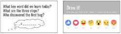
</note>

</notable>
[slides]: https://docs.google.com/presentation/d/1FgKmWaF_pMaASm99OrymMHRuv21OxrYji2d-nUP5Z10/edit?usp=sharing
[playlist]: http://www.pixelbots.io/7OBD7
[exit]: http://www.pixelbots.io/8K5K3
