<header title='PixelBots Emoji' subtitle='Lesson 05: Designing Emojis'/>

<notable>

<iconp src='/icons/activity.png'>### Overview</iconp>
Students learn and use the design thinking process to design an emoji in PixelBots that they think a friend or family member will like. Students will learn how to decompose their emoji into features.

<iconp src='/icons/objectives.png'>### Objectives</iconp>
- I can create a prototype on PixelBots using the design thinking process.
- I can decompose my prototype into features and write a comment on PixelBots for each feature.

<iconp src='/icons/agenda.png'>### Agenda</iconp>

#### Length: 90 minutes

1. **Engage:** Emoji Story (5 minutes)
1. **Explore/Explain:** Design Thinking (40 minutes)
1. **Elaborate:** Prototype (40 minutes)
1. **Evaluate:** Check Prototypes (5 minutes)

<note>

<iconp src='/icons/materials.png'>### Materials</iconp>

#### Teacher Materials
- Computer
- Projector
- PixelBots.io
- [Lesson 5 Slides][slides]
- [Project Rubric][rubric]

#### Student Materials
- Computer
- PixelBots Account
- Colored Pencils or Pencils
- [Design Thinking Worksheet][worksheet]
- [T&T Emoji | Project (code: NN53T)][project]
- [Emoji | Math Eye Smiley (Code: B2G8N)][example]

<iconp src='/icons/vocab.png'>### Vocabulary</iconp>
- **Empathize:** the ability to understand and share the feelings of another
- **Prototype:** a first functional form of a new design
- **Decomposition:** breaking a problem or system into parts that are easier to understand and program
- **Move To:** a coding block that helps move the bot to a specific square on the grid using two numbers, (x,y) coordinates

</note>
<pagebreak/>
 
#### 1. Engage: Emoji Story (5 minutes)
- [ ] **Turn & Talk:** Give students one minute to turn in pairs and review the concepts from the previous lesson and their favorite part of the lesson. Popcorn students and write a few student responses on the board. Reinforce the 3 steps of the Debugging Protocol.
  <iconp type='question'>What does it mean to Debug? </iconp>
  <iconp type='answer'>To find and fix a mistake.</iconp>
  <iconp type='question'>What are the 3 steps? </iconp>
  <iconp type='answer'>The 3 steps are Compare, Find, and Try.</iconp>
  <iconp type='question'>What was your favorite part about the last lesson?</iconp>
  <iconp type='answer'>Student answers will vary.</iconp>

<note>**Slides:**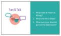
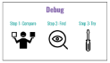</note>

- [ ] **Motivate:** Introduce the Design Thinking Process and how students will use this process to design an emoji that is meaningful for a friend or a family member.
  >>“Today you will begin your project by designing an emoji! All great creations go through a planning process. You will learn and use the design thinking process to help you create an emoji. Here's an overview of today’s lesson. (*click through slides with emojis*) To help motivate your design, you will create an emoji for a friend or a family member. Then ideas will be brainstormed, one of those ideas will turn into a design, that is then coded on the computer, and once it is all programmed you will have an emoji!”

<note>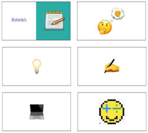</note>

#### 2. Explore/Explain: Design Thinking (40 minutes)
**EMPATHIZE** (7 minutes): Students will plan out their project using the Design Thinking process. Pass out [Design Thinking worksheet][worksheet].  Each part of the process you should define the word, model the process, then have students complete the step on their own.

- [ ] **Model:** Think of a person to create an emoji for and fill out Empathize section of the worksheet on the whiteboard while thinking aloud.
  >>“When creating a design, I first need to decide who I am creating it for and what they would want out of the design. What things do they like? What are their interests and needs?”
  - "I am creating an emoji for my dad."
  - "My dad likes reading, math and basketball."
  - "What I want to convey in this emoji might be my dad’s love for reading, how he always thinks about math, and the feeling of watching his favorite basketball team winning."

<note>
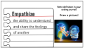
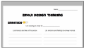</note>

- [ ] **Independent Exploration:** Students fill out Empathize section.
  >>“Your turn. Choose someone you are going to create your emoji for. What do they like? What are their interests?”

<note type="tip">Reference [Rubric][rubric] throughout Project Time to assess students' progress.</note>
**IDEATE** (8 minutes): Students will brainstorm all their possible ideas for an emoji that matches the person they empathized with in the previous step.

- [ ] **Model:** List as many ideas as you can for emojis in the Ideate section of worksheet.
  >>“Since my dad likes to read, he might want to be able to text me a book emoji. Since he likes math he might want to be able send a face with math symbols. Some other emojis he might like are an excited face, a basketball...”

<note>**Slides:**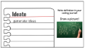</note>
- [ ] **Independent Exploration:** Students fill out Ideate section of worksheet.
  >>“Your turn. List as many emoji ideas as you can based on the person you are designing the emoji for.”

<note>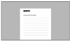</note>

**PROTOTYPE** (25 minutes): Students will sketch a prototype and receive peer feedback. Students will revise their emoji, sketch a second prototype, and then receive more peer feedback. Then students will sketch a third prototype on their worksheet.
- [ ] **Model** sketching the first prototype on the worksheet.
  >>“I will sketch the first prototype of my emoji. A prototype is a form of a design. Many designers make multiple prototypes before deciding on what they actually create.”

<note>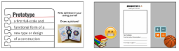</note>
<pagebreak/>
- [ ] **Independent Exploration:** Students sketch Prototype 1 on worksheet.
  >>“Your turn. Sketch your first prototype of your emoji.”

- [ ] **Peer Feedback & Revise:** Students swap design thinking worksheets and give peer feedback on Prototype 1. Students receive worksheets back, read feedback, and then sketch Prototype 2. Then continue with one more round of feedback on Prototype 2.
  >>“Before we jump straight into coding your emoji on PixelBots, we are going revise and improve our designs. All designers revise their work in order to get the best final product possible! Here is an example of Tony Stark revising his prototype. (*Watch clip from Iron Man*). Here is an example of how peer feedback helped in designing the Math Eyed Smiley (*show slide and read feedback*). Now let’s take some time to give your teammates feedback. Pass your paper to the person on your right and respond to the feedback prompts on the worksheet.”
  *Students write feedback (1-2 minutes)*
  “Pass back worksheets. Take some time to read your feedback. When you are ready, you can sketch Prototype 2. When everyone finishes sketching Prototype 2, we will have another round of peer feedback.”
  *Feedback on Prototype 2*
  “Take 1 minute to read over the feedback from your peers, and then design and sketch your final prototype. This will be the prototype we create in PixelBots.”

<note>**Slides:**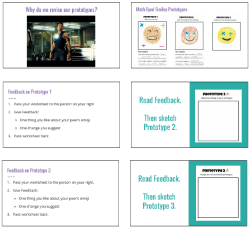</note>

#### 4. Elaborate: Prototype (40 minutes)
**Prototype on PixelBots.io** (15 minutes): Students transfer their prototype from their Emoji Design Thinking worksheets to PixelBots.

- [ ] **Model** how to paint on PixelBots using the paint and eraser tool on the PixelBots Emoji Project Challenge. Demonstrate how to paint on PixelBots OR show video on slide and narrate.
  >>“When you go to the Emoji Project Challenge, you will be able to paint your sketch of your prototype onto PixelBots. To paint on PixelBots, click on ‘Edit Goal’. Then you can select a color and click on squares to paint. You can click on the eraser tool and then click on squares to erase the color.”

<note>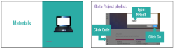</note>

- [ ] **Independent Exploration:** Students prototype their favorite pixel emoji idea on [T&T Emoji | Project (Code: NN53T)][project] challenge on PixelBots. Guide students how to get to the emoji prototype challenge.
  >>“Now it’s your turn. Look back at your Emoji Design Thinking worksheet as you paint your prototype on PixelBots. ”

<pagebreak/>
**DECOMPOSITION** (10 minutes): Students will break down the main parts of their prototype so that they are ready to code their project in purposeful parts.

- [ ] **Model:** Go through Decomposing Art slide and show how to use comments in PixelBots to decompose emoji.
  >>“Before I jump into coding my emoji, I need to break it into simpler parts. This is called decomposition. Follow along as I decompose the parts of my math face emoji. (*click through slide with arrows and decomposition*).”

<note>**Slides:**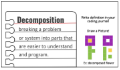</note>

- [ ] **Independent Exploration:** Students decompose their emoji by writing each feature as a comment on PixelBots.
  >>“Your turn. Decompose your emoji prototype and create a comment for each feature of your emoji. Your decomposed emoji will be the plan of how you code your emoji in PixelBots.”

<note>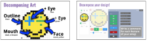</note>

- [ ] **Pair Share:** In pairs, students share their prototypes and give one positive comment about their partner’s emoji.
  >>“Coders like to share their projects and get input from other coders. Turn to your table partner and share who you are designing your emoji for and show them your prototype. Partners, share one thing you like about their emoji. Be specific.”

#### 6. Evaluate: Prototypes (5 minutes)
- [ ] **Evaluate:** Circulate and check in with each student on their completed emoji prototype with comments of how they decomposed their project into features.
<note>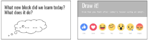</note>

- [ ] **Reflect:** Students reflect in their coding journals according to prompts on slides.
  >>“We are at the end of our coding lesson, let’s reflect. Take 30 seconds to draw how you felt about today’s lesson using an emoji. Take 30 seconds to write how you feel today using a hashtag! Now turn in pairs and share your responses.”

<note>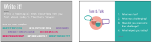</note>

</notable>
[rubric]:https://docs.google.com/document/d/17DSRCP9w8y1x0IVqWL3VGWezRoKbAetRXy5WIaAo67U/edit?usp=sharing
[slides]: https://docs.google.com/presentation/d/1IbWb2p3cHMhGWwgKFY-jVaAKh99TaJQhSXSLbubik2A/edit?usp=sharing
[worksheet]: https://docs.google.com/document/d/1M8PUzOcR0zXQguK3wxgIDGn0EQ7yjjX7fb2Ed4ZNa6k/edit?usp=sharing
[playlist]: http://www.pixelbots.io/GZ94P
[project]: http://www.pixelbots.io/NN53T
[example]: http://www.pixelbots.io/B2G8N
