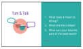
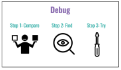
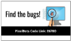
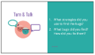
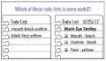
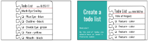
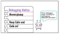
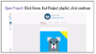
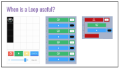
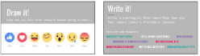

<header title='PixelBots Emoji' subtitle='Lesson 06: Review Loops & Project Time'/>

<notable>

<iconp src='/icons/activity.png'>### Overview</iconp>
Students will review loops and start coding their Emoji Projects using all the coding concepts learned in previous lessons: sequence and loops.

<iconp src='/icons/objectives.png'>### Objectives</iconp>
- I can code my project using sequences and loops.

<iconp src='/icons/agenda.png'>### Agenda</iconp>

#### Length: 90 minutes

1. **Engage:** Review & Debug  (15 minutes)
1. **Explore:** Decomposition ToDo list (10 minutes)
1. **Elaborate/Evaluate:** Project Time/Check Progress (55 minutes)
1. **Evaluate:** Wrap Up (10 minutes)

<note>

<iconp src='/icons/materials.png'>### Materials</iconp>

#### Teacher Materials
- Computer
- Projector
- PixelBots.io
- [Lesson 6 Slides][slides]

#### Student Materials
- Computer
- PixelBots Account
- [Design Thinking Worksheet][worksheet]
- [T&T Emoji | Project (Code: NN53T)][project]
- [T&T Emoji | 6 (Code: E678O) PixelBot Playlist][playlist]

<iconp src='/icons/vocab.png'>### Vocabulary</iconp>

</note>
<pagebreak/>

#### 1. Engage: Review & Debug  (15 minutes)
- [ ] **Turn & Talk:** Give students one minute to turn in pairs and review the concepts from the previous lesson. Discuss answers as a whole class.
  <iconp type='question'>What are the 3 steps to the debugging protocol? </iconp>
  <iconp type='answer'>The 3 steps are Compare, Find, and Try.</iconp>

<note>**Slides:**
</note>
- [ ] **Review:** Give students 5 minutes to try a debugging activity with loops in [T&T Emoji | 6  playlist (Code: E678O)][playlist].
  >>“We are starting our lesson with debugging challenges. You have 5 minutes to find and fix as many bugs as you can. Ready, set, go!”

<note></note>

- [ ] **Discuss:** Facilitate a class discussion about the debugging challenge. Reinforce the use of loops.
  <iconp type='question'>How did you rewrite the code to meet the line limit?</iconp>
  <iconp type='answer'>Replaced repeating sequences with loops.</iconp>
  <iconp type='question'>What strategies did you use to find the bugs?</iconp>
  <iconp type='question'>What bugs did you find? How did you fix them?</iconp>
  >>“A helpful tip when you start your emoji project is to run and check your program regularly. Write a few lines of code, run code, debug if necessary, then repeat.”

<note></note>
<pagebreak/>
#### 2. Explore: Decomposition To Do list (10 minutes)
- [ ] **Whip Around:** Students open their Emoji Prototypes on PixelBots.io and turn their computers to face the class. Call on students to share their emoji using 1 or 2 words. Every student should share.
  >>"Let’s take a quick look at everyone’s emoji prototype. Open your emoji prototype and think of 1-2 words you would use to describe your project. When you’re ready to share, turn your computer to face the class."

<note>**Slides:** </note>
- [ ] **Contrasting Cases:** Compare example and nonexample todo lists.
  <iconp type='question'>Which of these two todo lists is more useful?</iconp>
  <iconp type='answer'>The one on the right.</iconp>
  <iconp type='question'>What makes a todo list useful?</iconp>
  <iconp type='answer'>Each feature is listed on a separate line.</iconp>
  <iconp type='answer'>Each item is specific.</iconp>
  <iconp type='answer'>Each item is a single color.</iconp>
  <iconp type='answer'>There are check boxes so I can check off a feature when I am done.</iconp>
  <iconp type='answer'>Todo list is dated.</iconp>
  <iconp type='answer'>Says the name of the project the todo list is for.</iconp>
<note></note>

- [ ] **Model:** Show example todo list for math eyed emoji, listing all the features that need to be coded.
  >>“Last lesson, we decomposed our emojis into features. You will create a todo list of all the features that need to be coded in your emoji. Here is an example list for the Math Eyed Smiley emoji.”

<note></note>
- [ ] **Planning:** Students create a todo list in their coding journal.

<pagebreak/>
- [ ] **Motivate:** Students write a debugging motto/hashtag of the day to help motivate themselves when coding gets tough.
  >>“Coding can be tough, especially when you have bugs. So before we begin coding, let’s write motivational debugging mottos and hashtags. Then when coding gets tough today, you can read your debugging motto or hashtag to encourage yourself. For example, #nevergiveup or keep calm and code on!”

<note>**Slides:**</note>

- [ ] **Share out:** Have students share their debugging mottos with the class.
  >>“Let’s share out your motto’s and hashtags. If you hear one that you like, write it down in your journal.”

#### 3. Elaborate/Evaluate: Project Time/Check Progress (55 minutes)
- [ ] **Project:** Students have 55 minutes total to work on their final project, coding one feature at a time and checking it off their to do list. Guide students how to navigate to their project using the ‘Home’ button in the upper left. Click on ‘home’ and find T&T Emoji | Project playlist. Then click continue.
  >>“Now let’s start coding! Log into PixelBots.io. To open your project, click on ‘Home’, then find the T&T Emoji| Project Playlist, and click continue.”

<note></note>

- [ ] **Turn & Talk:** 30 minutes into Project Time, guide students in a 5 minute peer - revise/edit, and remind students of different code blocks.
  >>“Coders, let’s take a quick break to give our neighbors feedback. Turn to your right and look over your fellow coder’s progress. If they are feeling frustrated, share your debugging motto with them, or help look over their code. If they are doing great, give them some feedback on their design so far! Do the same with the person on your left.”

  <iconp type='question'>When is a loop useful?</iconp>
  <iconp type='answer'>When there is a long repeating sequence of code, rewrite it with a loop.</iconp>
<note>
</note>

- [ ] **Project:** Students will have the rest of the time to continue their project.  

- [ ] **Evaluate:** During project time, circulate and check students’ progress on project. Students should have at least two features of their Emoji Project completed by the end of today’s lesson. Ask the following guiding questions as needed, encourage the debugging mindset and use the vocabulary when possible.

  <iconp type='question'>Can you show me your sequence?</iconp>
  <iconp type='question'>Do you think you can use a loop any where? Is that harder or easier?</iconp>

#### 4. Evaluate: Wrap Up (10 minutes)
- [ ] **Evaluate:** Students self assess their own progress on their project. Students respond to the following prompts in their journals:
  <iconp type='question'>How did you feel about coding today?</iconp>
  <iconp type='question'>What do you want to work on next time?</iconp>

- [ ] **Discuss:** Guide students to find their “sole-mate,” someone with similar shoes (encourage students to get up and move around), and share out their feelings from coding today and encouraging advice for next time.
<note></note>

- [ ] **Reflect:** Students reflect in their coding journals according to prompts on slides.
  >>“Okay coders, we are at the end of our coding lesson. Let’s reflect using emojis and hashtags. Take 30 seconds to draw how you felt about today’s lesson using an emoji (pause for 30 seconds). Take 30 seconds to write how you feel today using a hashtag! (pause for 30 seconds). Now turn in pairs and share your responses.”

<note>
</note>

</notable>
[slides]:https://docs.google.com/presentation/d/1JnouGjee6fOmStntKtBdkD0lOy50UImAOMRgMCsZzAs/edit?usp=sharing
[playlist]: http://www.pixelbots.io/E678O
[project]: http://wwww.pixelbots.io/NN53T
[worksheet]: https://docs.google.com/document/d/1M8PUzOcR0zXQguK3wxgIDGn0EQ7yjjX7fb2Ed4ZNa6k/edit?usp=sharing
