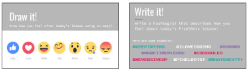
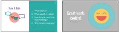

<header title='PixelBots Emoji' subtitle='Lesson 07: Project Time Continued'/>

<notable>

<iconp src='/icons/activity.png'>### Overview</iconp>
Students will continue to code their Emoji Projects using all the coding concepts learned in previous lessons: sequence and loops.

<iconp src='/icons/objectives.png'>### Objectives</iconp>
- I can code my project using sequences and loops.

<iconp src='/icons/agenda.png'>### Agenda</iconp>

#### Length: 90 minutes

1. **Engage:** Review & Debug  (10 minutes)
1. **Explore** Gallery Walk (15 minutes)
1. **Elaborate/Evaluate:** Project Time/Check Progress (60 minutes)
1. **Evaluate:** Wrap Up (5 minutes)

<note>

<iconp src='/icons/materials.png'>### Materials</iconp>

#### Teacher Materials
- [ ] Computer
- [ ] Projector
- [ ] PixelBots.io
- [ ] [Lesson 7 Slides][slides]

#### Student Materials
- [ ] Computer
- [ ] PixelBots Account
- [ ] Journal
- [ ] [Design Thinking Worksheet][worksheet]
- [ ] [T&T Emoji | 7 PixelBots playlist (code: 59OO4)][playlist]
- [ ] [T&T Emoji | Project (Code: NN53T)][project]

<iconp src='/icons/vocab.png'>### Vocabulary</iconp>

</note>
<pagebreak/>

#### 1. Engage: Review & Debug  (10 minutes)
- [ ] **Turn & Talk:** Give students one minute to turn in pairs and review the concepts from the previous lesson and their favorite part of the lesson. Popcorn students and write a few student responses on the board.
  <iconp type='question'>What was your favorite part about last lesson?</iconp>

<note>**Slides:**</note>

- [ ] **Review:** Give students 5 minutes to try a debugging activity with loops in [T&T Emoji | 7 playlist (code: 59OO4)][playlist]
  >>“Today you will continue your Emoji Project, but before you jump straight into coding your emoji, we are going to take some time to build our debugging skills. You have 5 minutes to find and fix as many bugs as you can in these challenges.”

  <note></note>
- [ ] **Discuss:** Facilitate a class discussion about the debugging challenge. Reinforce the use of loops and MoveTo block.
  <iconp type='question'>What strategies did you use to find the bugs?</iconp>
  <iconp type='question'>What bugs did you find? How did you fix them?</iconp>

<note></note>

#### 2. Explore: Gallery Walk (15 minutes)
- [ ] **Gallery Walk:** Students will open their prototypes on their laptops and show their works-in-progress. They will do a gallery walk for 10 minutes to provide feedback on post-its to each other on their emojis.
  >>“Before we continue, you will get a chance to check out other coder’s works in progress! As you walk around, take a post it and write down something you like, and a specific coding suggestion. Put the post it on the table, next to the laptop. An example of a specific suggestion is “use loops to color in your outline.” During this time, please respect your teammates’ code and computer.”
  *after gallery walk*
  <iconp type='question'>Why do we look at our works-in-progress?</iconp>
  <iconp type='answer'>Student answers will vary, but lead them to the conclusion that sharing our various works of progress allows everyone to see that there is a lot of progress being done, but everyone has struggles.</iconp>

<note>
</note>

**TIP:** Keep up the expectation of pencil and post-its only during this time, do not allow students to be typing on their computer or another student’s computer.

 
- [ ] **Motivate:** Students assess progress on project by looking at their code and set goals and mottos for the day.
  >>“Take a look at your code and your todo list from last lesson, create a list of what you want to code and finish today. For example, I already coded the eye and outline. Today my goal is to code the divide eye, face, and mouth. Take 2 minutes to write your goals."
  >"Now we are going to  set our debugging mottos. My debugging motto is #keepcoding.  Take 2 minutes to write your mottos and hashtags.”

  <note>**Slides:**
  </note>

- [ ] **Share out:** Have students share their debugging mottos with the class.
  >>“Let’s share our mottos and hashtags. If you hear one that you like, write it down in your journal.”

#### 3. Elaborate/Evaluate: Project Time/Check Progress (60 minutes)
- [ ] **Project:** Students have 60 minutes total to work on their final project, coding one feature of their emoji at a time and checking it off their todo list.
<note></note>

- [ ] **Turn & Talk:** 30 minutes into Project Time, guide students in a 5 minute peer - revise/edit.
  >>“Coders, let’s take a quick break to give our neighbors feedback. Turn to your right and check out your fellow coder’s progress. If they are feeling frustrated, share your debugging motto with them, or help look over their code. If they are doing great, give them some feedback on their design so far! Do the same with the person on your left.”

<note></note>
- [ ] **Evaluate:** During project time, circulate and check students' progress on Emoji. Students should have at least four features of their Emoji project completed. Ask the following guiding questions as needed, encourage the debugging mindset and use vocabulary when possible.
  <iconp type='question'>Can you show me your sequence?</iconp>
  <iconp type='question'>Do you think you can use a loop any where? Is that harder or easier?</iconp>

#### 4. Evaluate: Wrap Up (5 minutes)
- [ ] **Evaluate:** Students self assess their own progress on their project. Students respond to the following prompts in their journals:
  <iconp type='question'>How did you feel about coding today?</iconp>
  <iconp type='question'>What do you want to work on next time?</iconp>

<note>**Slides:**</note>
- [ ] **Discuss:** Guide students to find their “sole-mate,” someone with similar shoes (encourage students to get up and move around) and share out their feelings from coding today and encouraging advice for next time.

<note></note>
- [ ] **Reflect:** Students reflect in their coding journals according to prompts on slides.
  >>“Okay coders, we are at the end of our coding lesson, let’s reflect using emojis and hashtags. Take 30 seconds to draw how you felt about today’s lesson using an emoji (pause for 30 seconds). Take 30 seconds to write how you feel today using a hashtag! (pause for 30 seconds). Now turn in pairs and share your responses.”

<note>
</note>

</notable>
[slides]: https://docs.google.com/presentation/d/1O13bV-IoiIgmkpy6X2GBF_2znPevmSe0PguK17UIGFw/edit?usp=sharing
[playlist]: http://www.pixelbots.io/59OO4
[project]: http://www.pixelbots.io/NN53T
[worksheet]: https://docs.google.com/document/d/1M8PUzOcR0zXQguK3wxgIDGn0EQ7yjjX7fb2Ed4ZNa6k/edit?usp=sharing
