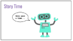

<header title='PixelBots Emoji' subtitle='Lesson 08: Project Time Continued'/>

<notable>

<iconp src='/icons/activity.png'>### Overview</iconp>
Students will continue to code their Emoji Projects using all the coding concepts learned in previous lessons: sequence and loops.

<iconp src='/icons/objectives.png'>### Objectives</iconp>
- I can code my project using sequences and loops.

<iconp src='/icons/agenda.png'>### Agenda</iconp>

#### Length: 90 minutes

1. **Engage:** Review & Debug  (10 minutes)
1. **Explore/Explain:** Story Time (15 minutes)
1. **Elaborate/Evaluate:** Project Time/Check Progress (60 minutes)
1. **Evaluate:** Wrap Up (5 minutes)

<note>

<iconp src='/icons/materials.png'>### Materials</iconp>

#### Teacher Materials
- Computer
- Projector
- PixelBots.io
- [Lesson 8 Slides][slides]

#### Student Materials
- Computer
- PixelBots Account
- Journal
- [Design Thinking Worksheet][worksheet]
- [T&T Emoji | 8 PixelBots playlist (code: M2DEB)][playlist]
- [T&T Emoji | Project (Code: NN53T)][project]

<iconp src='/icons/vocab.png'>### Vocabulary</iconp>

</note>
<pagebreak/>

#### 1. Engage: Review & Debug  (10 minutes)
- [ ] **Charades:** Give students 30 seconds to think of someone else’s emoji. Then each student will have roughly 15 seconds to act out someone else’s emoji. The rest of the class will guess whose emoji it is.
  >>“Let’s play a quick game of charades today. Think of someone else’s emoji that you saw during the gallery walk last week. You will get a chance to act out the emoji. You may use gestures or facial expressions, but no words! ”

<note>**Slides:**</note>

- [ ] **Review:** Give students 5 minutes to try a debugging challenge with loops in [T&T Emoji | 8 (Code: M2DEB)][playlist].
  >>“We are going to take some time to build our debugging skills. You have 5 minutes to find and fix as many bugs as you can in these challenges.”

<note></note>

- [ ] **Discuss:** Facilitate a class discussion about the debugging challenge. Reinforce the use of loops and MoveTo block.
  <iconp type='question'>What strategies did you use to find the bugs?</iconp>
  <iconp type='question'>What bugs did you find? How did you fix them?</iconp>

#### 2. Explore/Explain: Story Time (15 minutes)
- [ ] **Story Time/Team Building:** Students will get into groups of 3-4. They will create a short story based on their emojis that they will share with the class.
  >>“Before we continue, you will get into groups of 3-4. You will have 5 minutes to plan a short story involving all the emojis in your group. You may use the plot ideas on the board, or come up with one on your own! You will share out the story with your classmates in 5 minutes.”

<note>
</note>
- [ ] **Share Out:** Students share their short stories with the class.

<pagebreak/>
#### 3. Elaborate/Evaluate: Project Time/Check Progress (60 minutes)
- [ ] **Motivate:** Students assess their progress on the project by looking at their code. Then students set goals and mottos for the day.
  >>“So far I have coded the outline, division eye, plus eye, and mouth. I still need to code the face. I am going to list the features I still need to code. I need to code the face today, and if I have time I will go back to debug some areas I want to improve on. Now it’s time to set our debugging mottos. My debugging motto is #bugbuster, I’m like a ghostbuster, except I find bugs in my code and get rid of them. My other motto is #myemojirocks.  Now it is your turn! Write your mottos for today.”

<note>**Slides:**
</note>

- [ ] **Project:** Students have 60 minutes total to work on their final project, coding one feature of their emoji at a time and checking it off their todo list.

- [ ] **Turn & Talk:** 30 minutes into Project Time, guide students in a 5 minute peer - revise/edit.
  >>“Coders, let’s take a quick break to give our neighbors feedback. Turn to your right and check out your fellow coder’s progress. If they are feeling frustrated, share your debugging motto with them, or help look over their code. If they are doing great, give them some feedback on their design so far! Do the same with the person on your left.”

<note>

</note>

- [ ] **Evaluate:** During project time, circulate and check students' progress on Emoji. Students should have at least four features of their Emoji project completed. Ask the following guiding questions as needed, encourage the debugging mindset and use vocabulary when possible.
  <iconp type='question'>Can you show me your sequence?</iconp>
  <iconp type='question'>Do you think you can use a loop any where? Is that harder or easier?</iconp>

<pagebreak/>
#### 4. Evaluate: Wrap Up (5 minutes)
- [ ] **Evaluate:** Students self assess their own progress on their project and respond to the following prompts in their journals:
  <iconp type='question'>How did you feel about coding today?</iconp>
  <iconp type='question'>What do you want to work on next time?</iconp>

<note>**Slides:**</note>
- [ ] **Discuss:** Guide students to find their “sole-mate,” someone with similar shoes (encourage students to get up and move around) and share out their feelings from coding today and encouraging advice for next time.

<note></note>
- [ ] **Reflect:** Students reflect in their coding journals according to prompts on slides.
  >>“Okay coders, we are at the end of our coding lesson, let’s reflect using emojis and hashtags. Take 30 seconds to draw how you felt about today’s lesson using an emoji (pause for 30 seconds). Take 30 seconds to write how you feel today using a hashtag! (pause for 30 seconds). Now turn in pairs and share your responses.”

<note>
</note>

</notable>
[slides]: https://docs.google.com/presentation/d/14VeNopYmDGpdLTt75slmWgZfYLPDLV9G5M6GKN43Kyc/edit?usp=sharing
[playlist]: http://www.pixelbots.io/M2DEB
[project]: http://wwww.pixelbots.io/NN53T
[worksheet]: https://docs.google.com/document/d/1M8PUzOcR0zXQguK3wxgIDGn0EQ7yjjX7fb2Ed4ZNa6k/edit?usp=sharing
