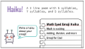
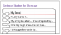
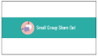
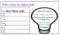
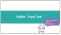
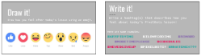

<header title='PixelBots Emoji' subtitle='Lesson 09: Showcase Prep'/>

<notable>

<iconp src='/icons/activity.png'>### Overview</iconp>
Students will continue to code their Emoji Projects using all the coding concepts learned in previous lessons: sequence and loops.

<iconp src='/icons/objectives.png'>### Objectives</iconp>
- I can code my project using sequences and loops.

<iconp src='/icons/agenda.png'>### Agenda</iconp>

#### Length: 90 minutes

1. **Engage:** Haiku  (10 minutes)
1. **Explore/Explain:** Prep for Showcase (15 minutes)
1. **Elaborate/Evaluate:** Project Time/Check Progress (60 minutes)
1. **Evaluate:** Wrap Up (5 minutes)

<note>

<iconp src='/icons/materials.png'>### Materials</iconp>

#### Teacher Materials
- Computer
- Projector
- PixelBots.io
- [Lesson 9 Slides][slides]

#### Student Materials
- Computer
- PixelBots Account
- Journal
- Paper for Haiku
- Color Pencils
- [Design Thinking Worksheet][worksheet]
- [T&T Emoji | Project (Code: NN53T)][project]

<iconp src='/icons/vocab.png'>### Vocabulary</iconp>

</note>
<pagebreak/>

#### 1. Engage: Haiku  (10 minutes)
- [ ] **Haiku:** Students write a haiku about their emoji that can be displayed during the showcase. Show students the example Math Eyed Smiley Haiku. Provide students with paper and colored pencils.
  >>“Today we are starting our lesson by writing a haiku about our emojis. A haiku is a poem that has a structure of 3 lines:  5 syllables, 7 syllables, and 5 syllables. Here is an example of a haiku for my math eyed emoji. (*read haiku aloud*) Write a haiku about your emoji.”
  - Example Haiku for Math Eyed Smiley: Math is exciting / Adding, division and more / Emoji for Dad

<note>**Slides:**</note>

#### 2. Elaborate: Prepare for Showcase (10 minutes)
- [ ] **Making:** Students will write a script for their project that they will deliver during the showcase.
  >>“Next week we will have a showcase to share your projects with your classmates, family, and friends. To get ready, you are going to write what what you will say when you present. Use these sentence starters and write what you will say in your journal. Feel free to share your ideas with a partner. You have 5 minutes and then you will share in small groups.”

<note></note>
- [ ] **Small Group Share Out:** Have students share their short stories in groups of 3-4.
  >>“Now it is your turn to practice your presentation with your classmates. If you are a listener, think of feedback you can provide to your teammates to make it more interesting: for example, “Speak louder,” or “eye contact” are great feedback comments.”

<note></note>

<pagebreak/>
#### 3. Elaborate: Letter & Project Time (60 minutes)
- [ ] **Project - Letter:** Students have 30 minutes to write a letter to a future coder. If they finish the letter, they can continue coding their emoji.
  >>“Coders, let’s take time to reflect on our whole experience of designing, building, and debugging your project. You are going to write a letter to a future coder. What do you wish that someone had told you about coding?  What have you learned about debugging? What was really fun about creating your emoji? What was really challenging? Take some time to write a detailed letter. If you finish your letter and it is checked by me, you may finish coding your final project.”

<note>**Slides:**

</note>

- [ ] **Project:** Students have the remaining time to finish coding their final project.

#### 4. Evaluate: Student Progress/Wrap Up (5 minutes)
- [ ] **Evaluate:** During project time, check in with each student and have them present their projects to you using their presentation script. Ask the following guiding questions as needed.
  <iconp type='question'>What was really difficult about coding your emoji?</iconp>
  <iconp type='question'>What did you really enjoy about your emoji?</iconp>
  <iconp type='question'>Is there anything you wished you would have done differently?</iconp>

- [ ] **Reflect:** Students reflect in their coding journals according to prompts on slides.
  >>“Okay coders, we are at the end of our coding lesson, let’s reflect using emojis and hashtags. Take 30 seconds to draw how you felt about today’s lesson using an emoji (pause for 30 seconds). Take 30 seconds to write how you feel today using a hashtag! (pause for 30 seconds). Now turn in pairs and share your responses. The next time we meet will be the showcase and I am really excited about all the emojis and how you will get to share them with your friends and family."

<note>
</note>

</notable>
[slides]: https://docs.google.com/presentation/d/1u8sEv5R7C7yipWWsqv3E4rb_8WlNr5U79H4tQw-IINw/edit?usp=sharing
[project]: http://wwww.pixelbots.io/NN53T
[worksheet]: https://docs.google.com/document/d/1M8PUzOcR0zXQguK3wxgIDGn0EQ7yjjX7fb2Ed4ZNa6k/edit?usp=sharing
